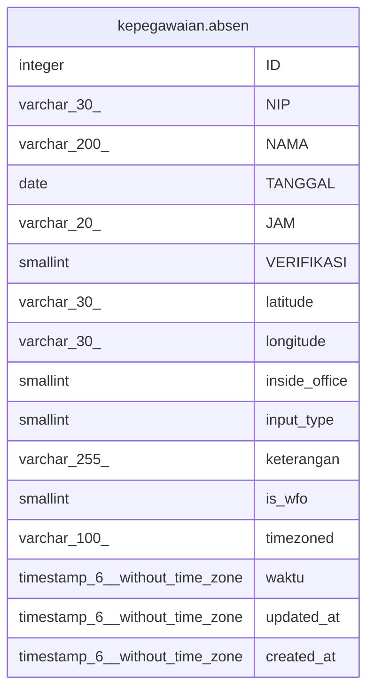

# kepegawaian.absen

## Description

## Columns

| Name | Type | Default | Nullable | Children | Parents | Comment |
| ---- | ---- | ------- | -------- | -------- | ------- | ------- |
| ID | integer | nextval('kepegawaian."absen_ID_seq"'::regclass) | false |  |  |  |
| NIP | varchar(30) |  | true |  |  |  |
| NAMA | varchar(200) |  | true |  |  |  |
| TANGGAL | date |  | true |  |  |  |
| JAM | varchar(20) |  | true |  |  |  |
| VERIFIKASI | smallint | 0 | true |  |  | 1=veririkasi ok, 0 : blm verifikasi |
| latitude | varchar(30) |  | true |  |  |  |
| longitude | varchar(30) |  | true |  |  |  |
| inside_office | smallint |  | true |  |  |  |
| input_type | smallint |  | true |  |  | 2 untuk pake browser |
| keterangan | varchar(255) |  | true |  |  |  |
| is_wfo | smallint |  | true |  |  |  |
| timezoned | varchar(100) |  | true |  |  |  |
| waktu | timestamp(6) without time zone |  | true |  |  |  |
| updated_at | timestamp(6) without time zone |  | true |  |  |  |
| created_at | timestamp(6) without time zone |  | true |  |  |  |

## Constraints

| Name | Type | Definition |
| ---- | ---- | ---------- |
| absen_pkey | PRIMARY KEY | PRIMARY KEY ("ID") |

## Indexes

| Name | Definition |
| ---- | ---------- |
| absen_pkey | CREATE UNIQUE INDEX absen_pkey ON kepegawaian.absen USING btree ("ID") |

## Relations

---

> Generated by [tbls](https://github.com/k1LoW/tbls)
