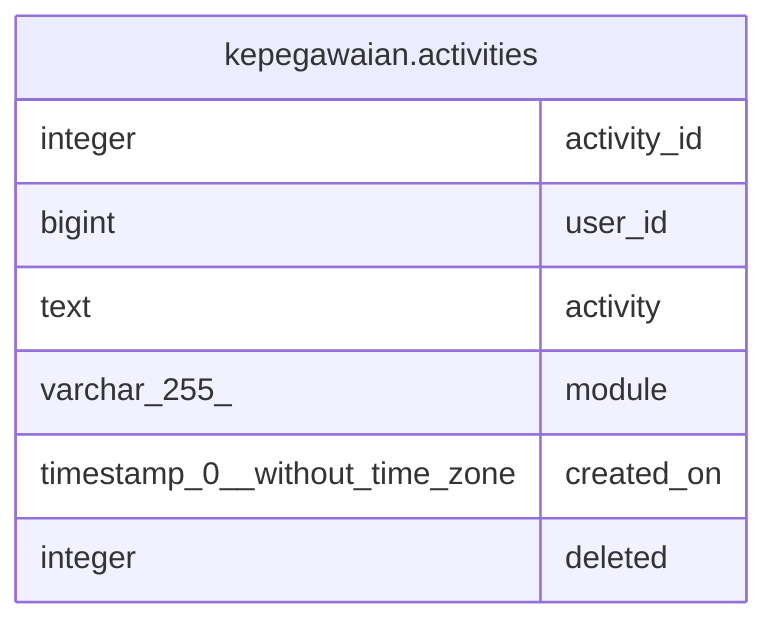

# kepegawaian.activities

## Description

## Columns

| Name | Type | Default | Nullable | Children | Parents | Comment |
| ---- | ---- | ------- | -------- | -------- | ------- | ------- |
| activity_id | integer | nextval('kepegawaian.activities_activity_id_seq'::regclass) | false |  |  |  |
| user_id | bigint | (0)::bigint | false |  |  |  |
| activity | text |  | false |  |  |  |
| module | varchar(255) |  | false |  |  |  |
| created_on | timestamp(0) without time zone |  | true |  |  |  |
| deleted | integer | 0 | false |  |  |  |

## Constraints

| Name | Type | Definition |
| ---- | ---- | ---------- |
| activities_pkey | PRIMARY KEY | PRIMARY KEY (activity_id) |

## Indexes

| Name | Definition |
| ---- | ---------- |
| activities_pkey | CREATE UNIQUE INDEX activities_pkey ON kepegawaian.activities USING btree (activity_id) |

## Relations

---

> Generated by [tbls](https://github.com/k1LoW/tbls)
