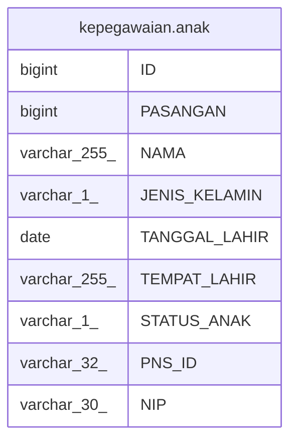

# kepegawaian.anak

## Description

## Columns

| Name | Type | Default | Nullable | Children | Parents | Comment |
| ---- | ---- | ------- | -------- | -------- | ------- | ------- |
| ID | bigint | nextval('kepegawaian."anak_ID_seq"'::regclass) | false |  |  |  |
| PASANGAN | bigint |  | true |  |  |  |
| NAMA | varchar(255) |  | true |  |  |  |
| JENIS_KELAMIN | varchar(1) |  | true |  |  |  |
| TANGGAL_LAHIR | date |  | true |  |  |  |
| TEMPAT_LAHIR | varchar(255) |  | true |  |  |  |
| STATUS_ANAK | varchar(1) |  | true |  |  |  |
| PNS_ID | varchar(32) |  | true |  |  |  |
| NIP | varchar(30) |  | true |  |  |  |

## Constraints

| Name | Type | Definition |
| ---- | ---- | ---------- |
| anak_pkey | PRIMARY KEY | PRIMARY KEY ("ID") |

## Indexes

| Name | Definition |
| ---- | ---------- |
| anak_pkey | CREATE UNIQUE INDEX anak_pkey ON kepegawaian.anak USING btree ("ID") |

## Relations

---

> Generated by [tbls](https://github.com/k1LoW/tbls)
