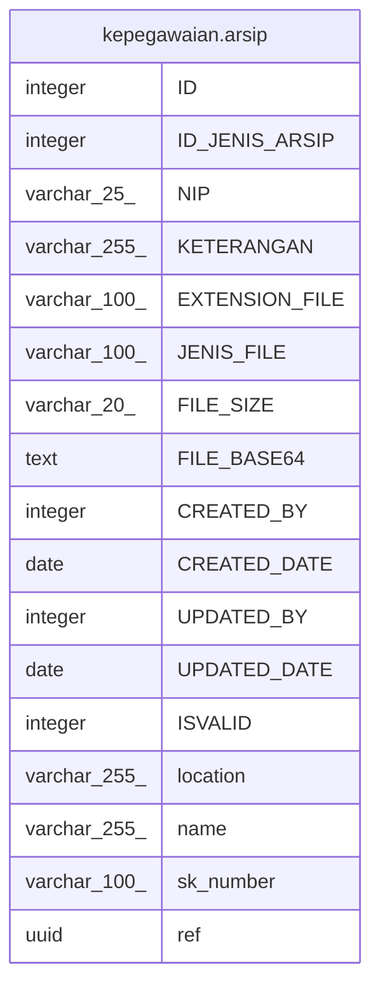

# kepegawaian.arsip

## Description

## Columns

| Name | Type | Default | Nullable | Children | Parents | Comment |
| ---- | ---- | ------- | -------- | -------- | ------- | ------- |
| ID | integer | nextval('kepegawaian."arsip_ID_seq"'::regclass) | false |  |  |  |
| ID_JENIS_ARSIP | integer |  | true |  |  |  |
| NIP | varchar(25) |  | true |  |  |  |
| KETERANGAN | varchar(255) |  | true |  |  |  |
| EXTENSION_FILE | varchar(100) |  | true |  |  | .doc, .xls, dll |
| JENIS_FILE | varchar(100) |  | true |  |  | image, document, zip, pdf |
| FILE_SIZE | varchar(20) |  | true |  |  |  |
| FILE_BASE64 | text |  | true |  |  |  |
| CREATED_BY | integer |  | true |  |  |  |
| CREATED_DATE | date |  | true |  |  |  |
| UPDATED_BY | integer |  | true |  |  |  |
| UPDATED_DATE | date |  | true |  |  |  |
| ISVALID | integer | 0 | true |  |  |  |
| location | varchar(255) |  | true |  |  |  |
| name | varchar(255) |  | true |  |  |  |
| sk_number | varchar(100) |  | true |  |  |  |
| ref | uuid | kepegawaian.uuid_generate_v4() | true |  |  |  |

## Constraints

| Name | Type | Definition |
| ---- | ---- | ---------- |
| arsip_pkey | PRIMARY KEY | PRIMARY KEY ("ID") |

## Indexes

| Name | Definition |
| ---- | ---------- |
| arsip_pkey | CREATE UNIQUE INDEX arsip_pkey ON kepegawaian.arsip USING btree ("ID") |

## Relations

---

> Generated by [tbls](https://github.com/k1LoW/tbls)
