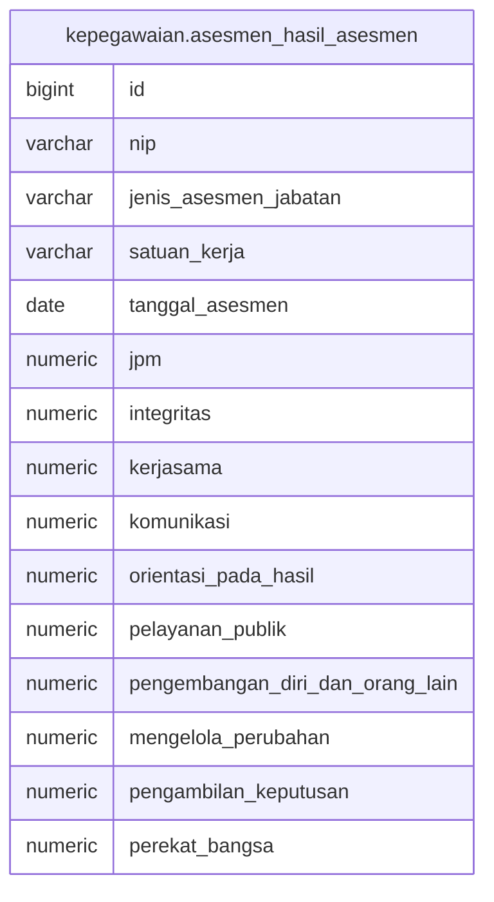

# kepegawaian.asesmen_hasil_asesmen

## Description

## Columns

| Name | Type | Default | Nullable | Children | Parents | Comment |
| ---- | ---- | ------- | -------- | -------- | ------- | ------- |
| id | bigint | nextval('kepegawaian.asesmen_hasil_asesmen_id_seq'::regclass) | false |  |  |  |
| nip | varchar |  | true |  |  |  |
| jenis_asesmen_jabatan | varchar |  | true |  |  |  |
| satuan_kerja | varchar |  | true |  |  |  |
| tanggal_asesmen | date |  | true |  |  |  |
| jpm | numeric |  | true |  |  |  |
| integritas | numeric |  | true |  |  |  |
| kerjasama | numeric |  | true |  |  |  |
| komunikasi | numeric |  | true |  |  |  |
| orientasi_pada_hasil | numeric |  | true |  |  |  |
| pelayanan_publik | numeric |  | true |  |  |  |
| pengembangan_diri_dan_orang_lain | numeric |  | true |  |  |  |
| mengelola_perubahan | numeric |  | true |  |  |  |
| pengambilan_keputusan | numeric |  | true |  |  |  |
| perekat_bangsa | numeric |  | true |  |  |  |

## Constraints

| Name | Type | Definition |
| ---- | ---- | ---------- |
| asesmen_hasil_asesmen_pkey | PRIMARY KEY | PRIMARY KEY (id) |

## Indexes

| Name | Definition |
| ---- | ---------- |
| asesmen_hasil_asesmen_pkey | CREATE UNIQUE INDEX asesmen_hasil_asesmen_pkey ON kepegawaian.asesmen_hasil_asesmen USING btree (id) |

## Relations

---

> Generated by [tbls](https://github.com/k1LoW/tbls)
