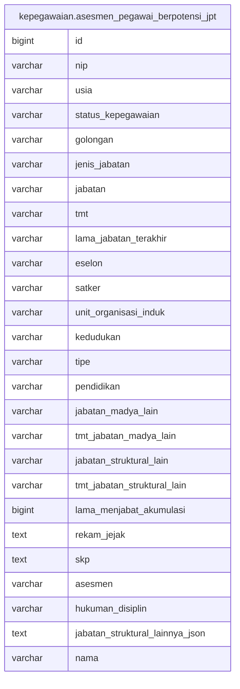

# kepegawaian.asesmen_pegawai_berpotensi_jpt

## Description

## Columns

| Name | Type | Default | Nullable | Children | Parents | Comment |
| ---- | ---- | ------- | -------- | -------- | ------- | ------- |
| id | bigint | nextval('kepegawaian.asesmen_pegawai_berpotensi_jpt_id_seq'::regclass) | false |  |  |  |
| nip | varchar |  | true |  |  |  |
| usia | varchar |  | true |  |  |  |
| status_kepegawaian | varchar |  | true |  |  |  |
| golongan | varchar |  | true |  |  |  |
| jenis_jabatan | varchar |  | true |  |  |  |
| jabatan | varchar |  | true |  |  |  |
| tmt | varchar |  | true |  |  |  |
| lama_jabatan_terakhir | varchar |  | true |  |  |  |
| eselon | varchar |  | true |  |  |  |
| satker | varchar |  | true |  |  |  |
| unit_organisasi_induk | varchar |  | true |  |  |  |
| kedudukan | varchar |  | true |  |  |  |
| tipe | varchar |  | true |  |  |  |
| pendidikan | varchar |  | true |  |  |  |
| jabatan_madya_lain | varchar |  | true |  |  |  |
| tmt_jabatan_madya_lain | varchar |  | true |  |  |  |
| jabatan_struktural_lain | varchar |  | true |  |  |  |
| tmt_jabatan_struktural_lain | varchar |  | true |  |  |  |
| lama_menjabat_akumulasi | bigint |  | true |  |  |  |
| rekam_jejak | text |  | true |  |  |  |
| skp | text |  | true |  |  |  |
| asesmen | varchar |  | true |  |  |  |
| hukuman_disiplin | varchar |  | true |  |  |  |
| jabatan_struktural_lainnya_json | text |  | true |  |  |  |
| nama | varchar |  | true |  |  |  |

## Constraints

| Name | Type | Definition |
| ---- | ---- | ---------- |
| asesmen_pegawai_berpotensi_jpt_pkey | PRIMARY KEY | PRIMARY KEY (id) |

## Indexes

| Name | Definition |
| ---- | ---------- |
| asesmen_pegawai_berpotensi_jpt_pkey | CREATE UNIQUE INDEX asesmen_pegawai_berpotensi_jpt_pkey ON kepegawaian.asesmen_pegawai_berpotensi_jpt USING btree (id) |

## Relations

---

> Generated by [tbls](https://github.com/k1LoW/tbls)
