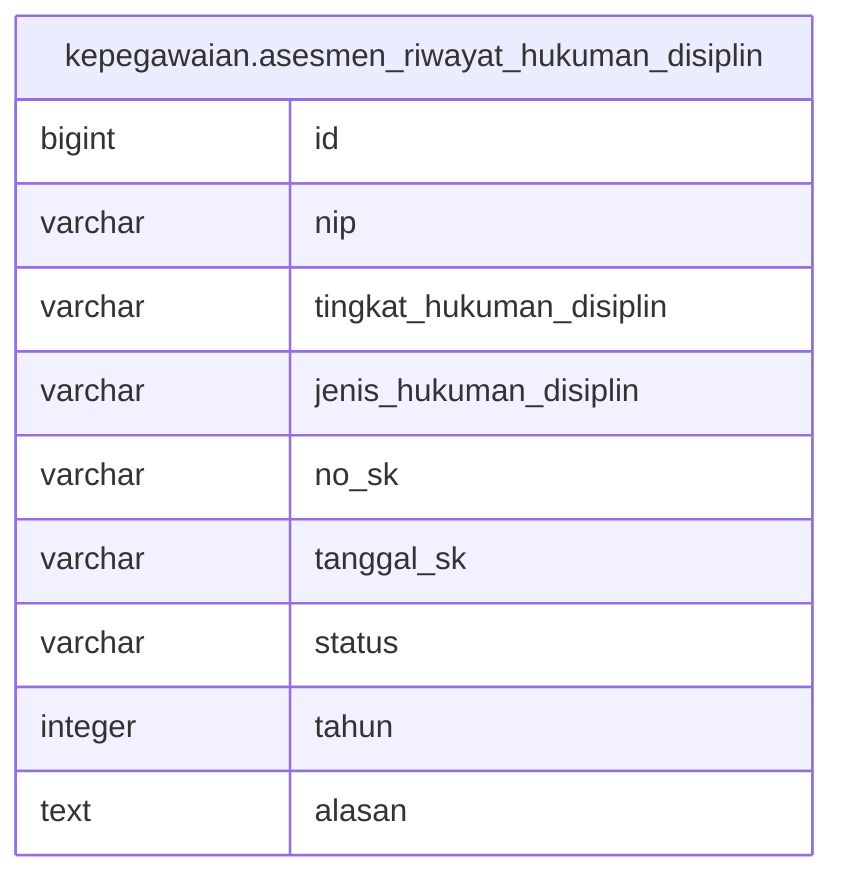

# kepegawaian.asesmen_riwayat_hukuman_disiplin

## Description

## Columns

| Name | Type | Default | Nullable | Children | Parents | Comment |
| ---- | ---- | ------- | -------- | -------- | ------- | ------- |
| id | bigint | nextval('kepegawaian.asesmen_riwayat_hukuman_disiplin_id_seq'::regclass) | false |  |  |  |
| nip | varchar |  | true |  |  |  |
| tingkat_hukuman_disiplin | varchar |  | true |  |  |  |
| jenis_hukuman_disiplin | varchar |  | true |  |  |  |
| no_sk | varchar |  | true |  |  |  |
| tanggal_sk | varchar |  | true |  |  |  |
| status | varchar |  | true |  |  |  |
| tahun | integer |  | true |  |  |  |
| alasan | text |  | true |  |  |  |

## Constraints

| Name | Type | Definition |
| ---- | ---- | ---------- |
| asesmen_riwayat_hukuman_disiplin_pkey | PRIMARY KEY | PRIMARY KEY (id) |

## Indexes

| Name | Definition |
| ---- | ---------- |
| asesmen_riwayat_hukuman_disiplin_pkey | CREATE UNIQUE INDEX asesmen_riwayat_hukuman_disiplin_pkey ON kepegawaian.asesmen_riwayat_hukuman_disiplin USING btree (id) |

## Relations

---

> Generated by [tbls](https://github.com/k1LoW/tbls)
