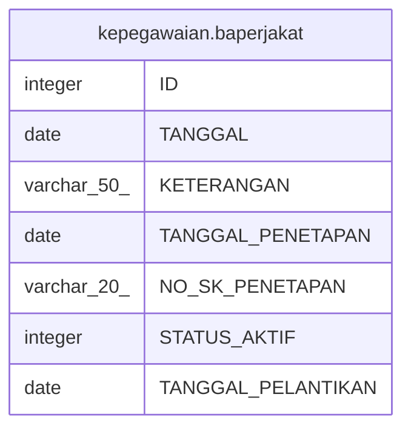

# kepegawaian.baperjakat

## Description

## Columns

| Name | Type | Default | Nullable | Children | Parents | Comment |
| ---- | ---- | ------- | -------- | -------- | ------- | ------- |
| ID | integer | nextval('kepegawaian."baperjakat_ID_seq"'::regclass) | false |  |  |  |
| TANGGAL | date |  | false |  |  |  |
| KETERANGAN | varchar(50) |  | true |  |  |  |
| TANGGAL_PENETAPAN | date |  | true |  |  |  |
| NO_SK_PENETAPAN | varchar(20) |  | true |  |  |  |
| STATUS_AKTIF | integer |  | true |  |  |  |
| TANGGAL_PELANTIKAN | date |  | true |  |  |  |

## Constraints

| Name | Type | Definition |
| ---- | ---- | ---------- |
| pk_baperjakat | PRIMARY KEY | PRIMARY KEY ("ID") |

## Indexes

| Name | Definition |
| ---- | ---------- |
| pk_baperjakat | CREATE UNIQUE INDEX pk_baperjakat ON kepegawaian.baperjakat USING btree ("ID") |

## Relations

---

> Generated by [tbls](https://github.com/k1LoW/tbls)
