# kepegawaian.daftar_pegawai

## Description

<details>
<summary><strong>Table Definition</strong></summary>

```sql
CREATE VIEW daftar_pegawai AS (
 SELECT pegawai."ID",
    pegawai."PNS_ID",
    pegawai."NIP_LAMA",
    pegawai."NIP_BARU",
    pegawai."NAMA",
    pegawai."GELAR_DEPAN",
    pegawai."GELAR_BELAKANG",
    pegawai."TEMPAT_LAHIR_ID",
    pegawai."TGL_LAHIR",
    pegawai."JENIS_KELAMIN",
    pegawai."AGAMA_ID",
    pegawai."JENIS_KAWIN_ID",
    pegawai."NIK",
    pegawai."NOMOR_DARURAT",
    pegawai."NOMOR_HP",
    pegawai."EMAIL",
    pegawai."ALAMAT",
    pegawai."NPWP",
    pegawai."BPJS",
    pegawai."JENIS_PEGAWAI_ID",
    pegawai."KEDUDUKAN_HUKUM_ID",
    pegawai."STATUS_CPNS_PNS",
    pegawai."KARTU_PEGAWAI",
    pegawai."NOMOR_SK_CPNS",
    pegawai."TGL_SK_CPNS",
    pegawai."TMT_CPNS",
    pegawai."TMT_PNS",
    pegawai."GOL_AWAL_ID",
    pegawai."GOL_ID",
    pegawai."TMT_GOLONGAN",
    pegawai."MK_TAHUN",
    pegawai."MK_BULAN",
    pegawai."JENIS_JABATAN_IDx" AS "JENIS_JABATAN_ID",
    pegawai."JABATAN_ID",
    pegawai."TMT_JABATAN",
    pegawai."PENDIDIKAN_ID",
    pegawai."TAHUN_LULUS",
    pegawai."KPKN_ID",
    pegawai."LOKASI_KERJA_ID",
    pegawai."UNOR_ID",
    pegawai."UNOR_INDUK_ID",
    pegawai."INSTANSI_INDUK_ID",
    pegawai."INSTANSI_KERJA_ID",
    pegawai."SATUAN_KERJA_INDUK_ID",
    pegawai."SATUAN_KERJA_KERJA_ID",
    pegawai."GOLONGAN_DARAH",
    pegawai."PHOTO",
    pegawai."TMT_PENSIUN",
    pegawai."LOKASI_KERJA",
    pegawai."NO_SURAT_DOKTER",
    pegawai."JML_ISTRI",
    pegawai."JML_ANAK",
    pegawai."TGL_SURAT_DOKTER",
    pegawai."NO_BEBAS_NARKOBA",
    pegawai."TGL_BEBAS_NARKOBA",
    pegawai."NO_CATATAN_POLISI",
    pegawai."TGL_CATATAN_POLISI",
    pegawai."AKTE_KELAHIRAN",
    pegawai."STATUS_HIDUP",
    pegawai."AKTE_MENINGGAL",
    pegawai."TGL_MENINGGAL",
    pegawai."NO_ASKES",
    pegawai."NO_TASPEN",
    pegawai."TGL_NPWP",
    pegawai."TEMPAT_LAHIR",
    pegawai."PENDIDIKAN",
    pegawai."TK_PENDIDIKAN",
    pegawai."TEMPAT_LAHIR_NAMA",
    pegawai."JENIS_JABATAN_NAMA",
    pegawai."JABATAN_NAMA",
    pegawai."KPKN_NAMA",
    pegawai."INSTANSI_INDUK_NAMA",
    pegawai."INSTANSI_KERJA_NAMA",
    pegawai."SATUAN_KERJA_INDUK_NAMA",
    pegawai."SATUAN_KERJA_NAMA",
    pegawai."JABATAN_INSTANSI_ID",
    pegawai."BUP",
    date_part('year'::text, age((pegawai."TGL_LAHIR")::timestamp with time zone)) AS "AGE",
    vw."ESELON_1",
    vw."ESELON_2",
    vw."ESELON_3",
    vw."ESELON_4",
    date_part('year'::text, pegawai."TGL_LAHIR") AS tahun_lahir
   FROM (kepegawaian.pegawai
     LEFT JOIN kepegawaian.vw_unit_list vw ON (((pegawai."UNOR_ID")::text = (vw."ID")::text)))
)
```

</details>

## Columns

| Name | Type | Default | Nullable | Children | Parents | Comment |
| ---- | ---- | ------- | -------- | -------- | ------- | ------- |
| ID | integer |  | true |  |  |  |
| PNS_ID | varchar(36) |  | true |  |  |  |
| NIP_LAMA | varchar(9) |  | true |  |  |  |
| NIP_BARU | varchar(18) |  | true |  |  |  |
| NAMA | varchar(255) |  | true |  |  |  |
| GELAR_DEPAN | varchar(60) |  | true |  |  |  |
| GELAR_BELAKANG | varchar(60) |  | true |  |  |  |
| TEMPAT_LAHIR_ID | varchar(50) |  | true |  |  |  |
| TGL_LAHIR | date |  | true |  |  |  |
| JENIS_KELAMIN | varchar(10) |  | true |  |  |  |
| AGAMA_ID | integer |  | true |  |  |  |
| JENIS_KAWIN_ID | varchar(255) |  | true |  |  |  |
| NIK | varchar(255) |  | true |  |  |  |
| NOMOR_DARURAT | varchar(255) |  | true |  |  |  |
| NOMOR_HP | varchar(60) |  | true |  |  |  |
| EMAIL | varchar(255) |  | true |  |  |  |
| ALAMAT | varchar(255) |  | true |  |  |  |
| NPWP | varchar(255) |  | true |  |  |  |
| BPJS | varchar(50) |  | true |  |  |  |
| JENIS_PEGAWAI_ID | varchar(50) |  | true |  |  |  |
| KEDUDUKAN_HUKUM_ID | varchar(36) |  | true |  |  |  |
| STATUS_CPNS_PNS | varchar(20) |  | true |  |  |  |
| KARTU_PEGAWAI | varchar(30) |  | true |  |  |  |
| NOMOR_SK_CPNS | varchar(60) |  | true |  |  |  |
| TGL_SK_CPNS | date |  | true |  |  |  |
| TMT_CPNS | date |  | true |  |  |  |
| TMT_PNS | date |  | true |  |  |  |
| GOL_AWAL_ID | varchar(36) |  | true |  |  |  |
| GOL_ID | integer |  | true |  |  |  |
| TMT_GOLONGAN | date |  | true |  |  |  |
| MK_TAHUN | varchar(20) |  | true |  |  |  |
| MK_BULAN | varchar(20) |  | true |  |  |  |
| JENIS_JABATAN_ID | varchar(36) |  | true |  |  |  |
| JABATAN_ID | varchar(36) |  | true |  |  |  |
| TMT_JABATAN | date |  | true |  |  |  |
| PENDIDIKAN_ID | varchar(36) |  | true |  |  |  |
| TAHUN_LULUS | varchar(20) |  | true |  |  |  |
| KPKN_ID | varchar(36) |  | true |  |  |  |
| LOKASI_KERJA_ID | varchar(36) |  | true |  |  |  |
| UNOR_ID | varchar(36) |  | true |  |  |  |
| UNOR_INDUK_ID | varchar(36) |  | true |  |  |  |
| INSTANSI_INDUK_ID | varchar(36) |  | true |  |  |  |
| INSTANSI_KERJA_ID | varchar(36) |  | true |  |  |  |
| SATUAN_KERJA_INDUK_ID | varchar(36) |  | true |  |  |  |
| SATUAN_KERJA_KERJA_ID | varchar(36) |  | true |  |  |  |
| GOLONGAN_DARAH | varchar(20) |  | true |  |  |  |
| PHOTO | varchar(100) |  | true |  |  |  |
| TMT_PENSIUN | date |  | true |  |  |  |
| LOKASI_KERJA | character(200) |  | true |  |  |  |
| NO_SURAT_DOKTER | character(100) |  | true |  |  |  |
| JML_ISTRI | character(1) |  | true |  |  |  |
| JML_ANAK | character(1) |  | true |  |  |  |
| TGL_SURAT_DOKTER | date |  | true |  |  |  |
| NO_BEBAS_NARKOBA | character(100) |  | true |  |  |  |
| TGL_BEBAS_NARKOBA | date |  | true |  |  |  |
| NO_CATATAN_POLISI | character(100) |  | true |  |  |  |
| TGL_CATATAN_POLISI | date |  | true |  |  |  |
| AKTE_KELAHIRAN | character(50) |  | true |  |  |  |
| STATUS_HIDUP | character(15) |  | true |  |  |  |
| AKTE_MENINGGAL | character(50) |  | true |  |  |  |
| TGL_MENINGGAL | date |  | true |  |  |  |
| NO_ASKES | character(50) |  | true |  |  |  |
| NO_TASPEN | character(50) |  | true |  |  |  |
| TGL_NPWP | date |  | true |  |  |  |
| TEMPAT_LAHIR | character(200) |  | true |  |  |  |
| PENDIDIKAN | character(165) |  | true |  |  |  |
| TK_PENDIDIKAN | character(3) |  | true |  |  |  |
| TEMPAT_LAHIR_NAMA | character(200) |  | true |  |  |  |
| JENIS_JABATAN_NAMA | character(200) |  | true |  |  |  |
| JABATAN_NAMA | character(254) |  | true |  |  |  |
| KPKN_NAMA | character(255) |  | true |  |  |  |
| INSTANSI_INDUK_NAMA | character(100) |  | true |  |  |  |
| INSTANSI_KERJA_NAMA | character(160) |  | true |  |  |  |
| SATUAN_KERJA_INDUK_NAMA | character(170) |  | true |  |  |  |
| SATUAN_KERJA_NAMA | character(155) |  | true |  |  |  |
| JABATAN_INSTANSI_ID | character(15) |  | true |  |  |  |
| BUP | smallint |  | true |  |  |  |
| AGE | double precision |  | true |  |  |  |
| ESELON_1 | varchar(32) |  | true |  |  |  |
| ESELON_2 | varchar(32) |  | true |  |  |  |
| ESELON_3 | varchar(32) |  | true |  |  |  |
| ESELON_4 | varchar(32) |  | true |  |  |  |
| tahun_lahir | double precision |  | true |  |  |  |

## Referenced Tables

| Name | Columns | Comment | Type |
| ---- | ------- | ------- | ---- |
| [kepegawaian.pegawai](kepegawaian.pegawai.md) | 100 |  | BASE TABLE |
| [kepegawaian.vw_unit_list](kepegawaian.vw_unit_list.md) | 30 |  | MATERIALIZED VIEW |

## Relations

```mermaid
erDiagram


"kepegawaian.daftar_pegawai" {
  integer ID
  varchar_36_ PNS_ID
  varchar_9_ NIP_LAMA
  varchar_18_ NIP_BARU
  varchar_255_ NAMA
  varchar_60_ GELAR_DEPAN
  varchar_60_ GELAR_BELAKANG
  varchar_50_ TEMPAT_LAHIR_ID
  date TGL_LAHIR
  varchar_10_ JENIS_KELAMIN
  integer AGAMA_ID
  varchar_255_ JENIS_KAWIN_ID
  varchar_255_ NIK
  varchar_255_ NOMOR_DARURAT
  varchar_60_ NOMOR_HP
  varchar_255_ EMAIL
  varchar_255_ ALAMAT
  varchar_255_ NPWP
  varchar_50_ BPJS
  varchar_50_ JENIS_PEGAWAI_ID
  varchar_36_ KEDUDUKAN_HUKUM_ID
  varchar_20_ STATUS_CPNS_PNS
  varchar_30_ KARTU_PEGAWAI
  varchar_60_ NOMOR_SK_CPNS
  date TGL_SK_CPNS
  date TMT_CPNS
  date TMT_PNS
  varchar_36_ GOL_AWAL_ID
  integer GOL_ID
  date TMT_GOLONGAN
  varchar_20_ MK_TAHUN
  varchar_20_ MK_BULAN
  varchar_36_ JENIS_JABATAN_ID
  varchar_36_ JABATAN_ID
  date TMT_JABATAN
  varchar_36_ PENDIDIKAN_ID
  varchar_20_ TAHUN_LULUS
  varchar_36_ KPKN_ID
  varchar_36_ LOKASI_KERJA_ID
  varchar_36_ UNOR_ID
  varchar_36_ UNOR_INDUK_ID
  varchar_36_ INSTANSI_INDUK_ID
  varchar_36_ INSTANSI_KERJA_ID
  varchar_36_ SATUAN_KERJA_INDUK_ID
  varchar_36_ SATUAN_KERJA_KERJA_ID
  varchar_20_ GOLONGAN_DARAH
  varchar_100_ PHOTO
  date TMT_PENSIUN
  character_200_ LOKASI_KERJA
  character_100_ NO_SURAT_DOKTER
  character_1_ JML_ISTRI
  character_1_ JML_ANAK
  date TGL_SURAT_DOKTER
  character_100_ NO_BEBAS_NARKOBA
  date TGL_BEBAS_NARKOBA
  character_100_ NO_CATATAN_POLISI
  date TGL_CATATAN_POLISI
  character_50_ AKTE_KELAHIRAN
  character_15_ STATUS_HIDUP
  character_50_ AKTE_MENINGGAL
  date TGL_MENINGGAL
  character_50_ NO_ASKES
  character_50_ NO_TASPEN
  date TGL_NPWP
  character_200_ TEMPAT_LAHIR
  character_165_ PENDIDIKAN
  character_3_ TK_PENDIDIKAN
  character_200_ TEMPAT_LAHIR_NAMA
  character_200_ JENIS_JABATAN_NAMA
  character_254_ JABATAN_NAMA
  character_255_ KPKN_NAMA
  character_100_ INSTANSI_INDUK_NAMA
  character_160_ INSTANSI_KERJA_NAMA
  character_170_ SATUAN_KERJA_INDUK_NAMA
  character_155_ SATUAN_KERJA_NAMA
  character_15_ JABATAN_INSTANSI_ID
  smallint BUP
  double_precision AGE
  varchar_32_ ESELON_1
  varchar_32_ ESELON_2
  varchar_32_ ESELON_3
  varchar_32_ ESELON_4
  double_precision tahun_lahir
}
```



---

> Generated by [tbls](https://github.com/k1LoW/tbls)
