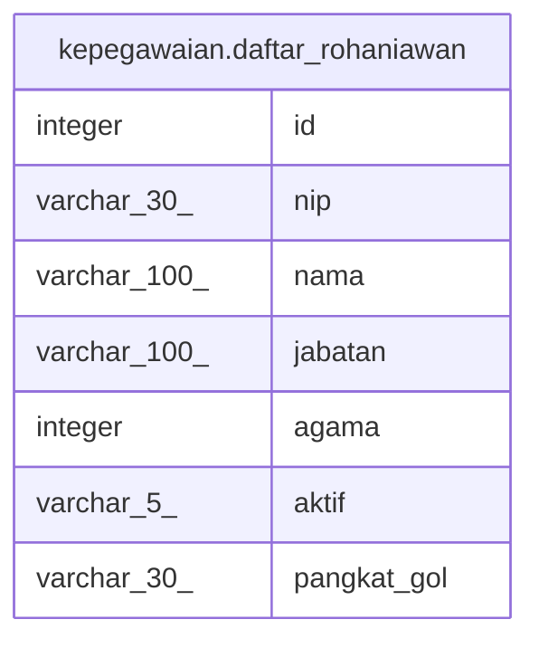

# kepegawaian.daftar_rohaniawan

## Description

## Columns

| Name | Type | Default | Nullable | Children | Parents | Comment |
| ---- | ---- | ------- | -------- | -------- | ------- | ------- |
| id | integer | nextval('kepegawaian.daftar_rohaniawan_id_seq'::regclass) | false |  |  |  |
| nip | varchar(30) |  | true |  |  |  |
| nama | varchar(100) |  | true |  |  |  |
| jabatan | varchar(100) |  | true |  |  |  |
| agama | integer |  | true |  |  |  |
| aktif | varchar(5) |  | true |  |  |  |
| pangkat_gol | varchar(30) |  | true |  |  |  |

## Constraints

| Name | Type | Definition |
| ---- | ---- | ---------- |
| pk_daftar_rohaniawan | PRIMARY KEY | PRIMARY KEY (id) |

## Indexes

| Name | Definition |
| ---- | ---------- |
| pk_daftar_rohaniawan | CREATE UNIQUE INDEX pk_daftar_rohaniawan ON kepegawaian.daftar_rohaniawan USING btree (id) |

## Relations

---

> Generated by [tbls](https://github.com/k1LoW/tbls)
