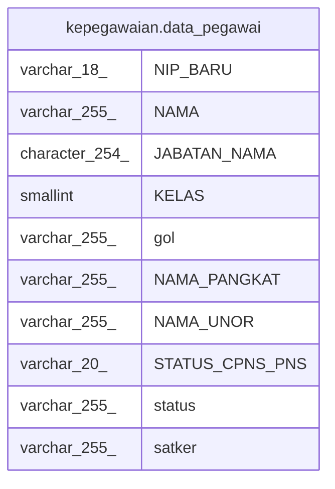

# kepegawaian.data_pegawai

## Description

<details>
<summary><strong>Table Definition</strong></summary>

```sql
CREATE VIEW data_pegawai AS (
 SELECT a."NIP_BARU",
    a."NAMA",
    a."JABATAN_NAMA",
    b."KELAS",
    c."NAMA" AS gol,
    c."NAMA_PANGKAT",
    d."NAMA_UNOR",
    a."STATUS_CPNS_PNS",
    e."NAMA" AS status,
    f."NAMA_UNOR" AS satker
   FROM (((((kepegawaian.pegawai a
     JOIN kepegawaian.jabatan b ON ((a."JABATAN_INSTANSI_ID" = (b."KODE_JABATAN")::bpchar)))
     JOIN kepegawaian.golongan c ON ((a."GOL_ID" = c."ID")))
     JOIN kepegawaian.unitkerja d ON (((a."UNOR_ID")::text = (d."ID")::text)))
     JOIN kepegawaian.unitkerja f ON (((f."ID")::text = (d."UNOR_INDUK")::text)))
     JOIN kepegawaian.kedudukan_hukum e ON (((a."KEDUDUKAN_HUKUM_ID")::text = (e."ID")::text)))
  WHERE (a."JABATAN_INSTANSI_ID" <> '0'::bpchar)
)
```

</details>

## Columns

| Name | Type | Default | Nullable | Children | Parents | Comment |
| ---- | ---- | ------- | -------- | -------- | ------- | ------- |
| NIP_BARU | varchar(18) |  | true |  |  |  |
| NAMA | varchar(255) |  | true |  |  |  |
| JABATAN_NAMA | character(254) |  | true |  |  |  |
| KELAS | smallint |  | true |  |  |  |
| gol | varchar(255) |  | true |  |  |  |
| NAMA_PANGKAT | varchar(255) |  | true |  |  |  |
| NAMA_UNOR | varchar(255) |  | true |  |  |  |
| STATUS_CPNS_PNS | varchar(20) |  | true |  |  |  |
| status | varchar(255) |  | true |  |  |  |
| satker | varchar(255) |  | true |  |  |  |

## Referenced Tables

| Name | Columns | Comment | Type |
| ---- | ------- | ------- | ---- |
| [kepegawaian.pegawai](kepegawaian.pegawai.md) | 100 |  | BASE TABLE |
| [kepegawaian.jabatan](kepegawaian.jabatan.md) | 12 |  | BASE TABLE |
| [kepegawaian.golongan](kepegawaian.golongan.md) | 6 |  | BASE TABLE |
| [kepegawaian.unitkerja](kepegawaian.unitkerja.md) | 30 |  | BASE TABLE |
| [kepegawaian.kedudukan_hukum](kepegawaian.kedudukan_hukum.md) | 2 |  | BASE TABLE |

## Relations



---

> Generated by [tbls](https://github.com/k1LoW/tbls)
