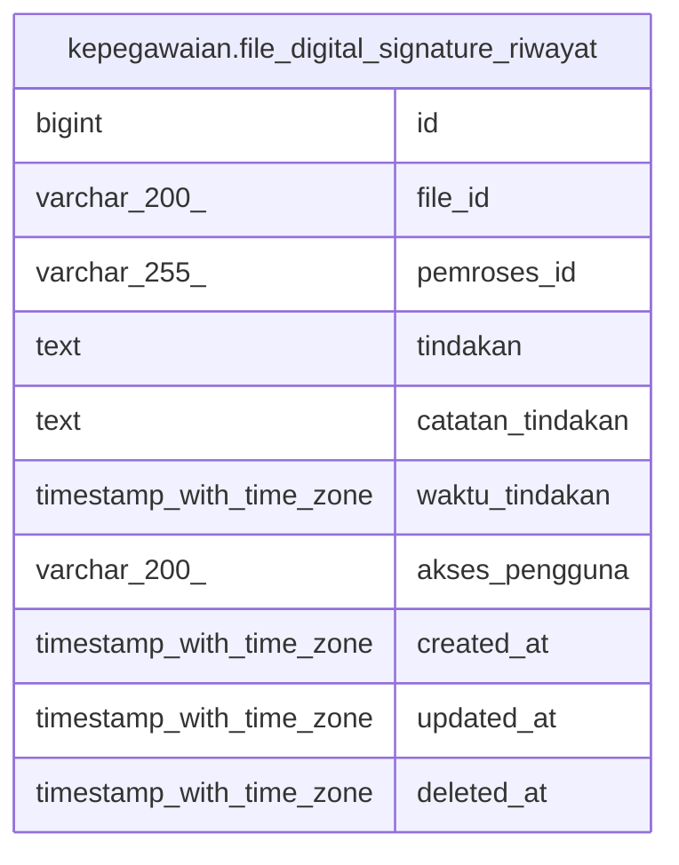

# kepegawaian.file_digital_signature_riwayat

## Description

## Columns

| Name | Type | Default | Nullable | Children | Parents | Comment |
| ---- | ---- | ------- | -------- | -------- | ------- | ------- |
| id | bigint | nextval('file_digital_signature_riwayat_id_seq'::regclass) | false |  |  |  |
| file_id | varchar(200) |  | true |  |  |  |
| pemroses_id | varchar(255) |  | true |  |  |  |
| tindakan | text |  | true |  |  |  |
| catatan_tindakan | text |  | true |  |  |  |
| waktu_tindakan | timestamp with time zone |  | true |  |  |  |
| akses_pengguna | varchar(200) |  | true |  |  |  |
| created_at | timestamp with time zone | now() | true |  |  |  |
| updated_at | timestamp with time zone | now() | true |  |  |  |
| deleted_at | timestamp with time zone |  | true |  |  |  |

## Constraints

| Name | Type | Definition |
| ---- | ---- | ---------- |
| file_digital_signature_riwayat_pkey | PRIMARY KEY | PRIMARY KEY (id) |

## Indexes

| Name | Definition |
| ---- | ---------- |
| file_digital_signature_riwayat_pkey | CREATE UNIQUE INDEX file_digital_signature_riwayat_pkey ON kepegawaian.file_digital_signature_riwayat USING btree (id) |

## Relations

---

> Generated by [tbls](https://github.com/k1LoW/tbls)
