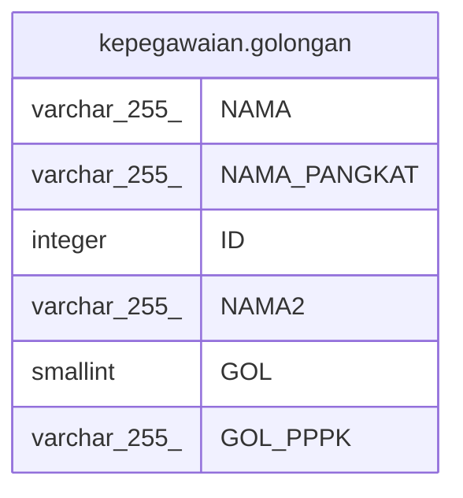

# kepegawaian.golongan

## Description

## Columns

| Name | Type | Default | Nullable | Children | Parents | Comment |
| ---- | ---- | ------- | -------- | -------- | ------- | ------- |
| NAMA | varchar(255) |  | true |  |  |  |
| NAMA_PANGKAT | varchar(255) |  | true |  |  |  |
| ID | integer |  | false |  |  |  |
| NAMA2 | varchar(255) |  | true |  |  |  |
| GOL | smallint |  | true |  |  |  |
| GOL_PPPK | varchar(255) |  | true |  |  |  |

## Constraints

| Name | Type | Definition |
| ---- | ---- | ---------- |
| golongan_pkey | PRIMARY KEY | PRIMARY KEY ("ID") |

## Indexes

| Name | Definition |
| ---- | ---------- |
| golongan_pkey | CREATE UNIQUE INDEX golongan_pkey ON kepegawaian.golongan USING btree ("ID") |

## Relations

---

> Generated by [tbls](https://github.com/k1LoW/tbls)
