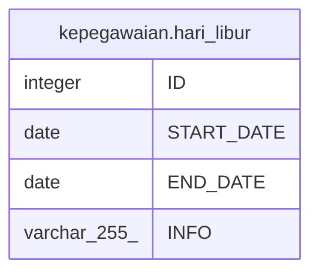

# kepegawaian.hari_libur

## Description

## Columns

| Name | Type | Default | Nullable | Children | Parents | Comment |
| ---- | ---- | ------- | -------- | -------- | ------- | ------- |
| ID | integer | nextval('kepegawaian."hari_libur_ID_seq"'::regclass) | false |  |  |  |
| START_DATE | date |  | true |  |  |  |
| END_DATE | date |  | true |  |  |  |
| INFO | varchar(255) |  | true |  |  |  |

## Constraints

| Name | Type | Definition |
| ---- | ---- | ---------- |
| hari_libur_pkey | PRIMARY KEY | PRIMARY KEY ("ID") |

## Indexes

| Name | Definition |
| ---- | ---------- |
| hari_libur_pkey | CREATE UNIQUE INDEX hari_libur_pkey ON kepegawaian.hari_libur USING btree ("ID") |

## Relations

---

> Generated by [tbls](https://github.com/k1LoW/tbls)
