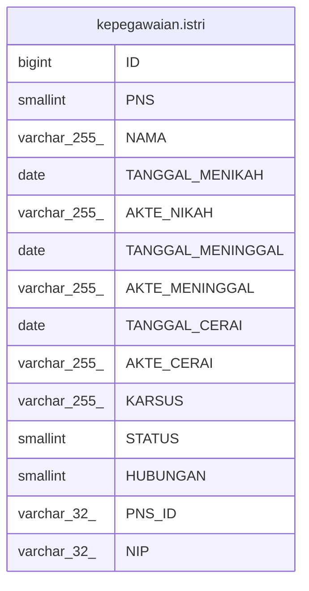

# kepegawaian.istri

## Description

## Columns

| Name | Type | Default | Nullable | Children | Parents | Comment |
| ---- | ---- | ------- | -------- | -------- | ------- | ------- |
| ID | bigint | nextval('kepegawaian."istri_ID_seq"'::regclass) | false |  |  |  |
| PNS | smallint |  | true |  |  | 1=pns |
| NAMA | varchar(255) |  | true |  |  |  |
| TANGGAL_MENIKAH | date |  | true |  |  |  |
| AKTE_NIKAH | varchar(255) |  | true |  |  |  |
| TANGGAL_MENINGGAL | date |  | true |  |  |  |
| AKTE_MENINGGAL | varchar(255) |  | true |  |  |  |
| TANGGAL_CERAI | date |  | true |  |  |  |
| AKTE_CERAI | varchar(255) |  | true |  |  |  |
| KARSUS | varchar(255) |  | true |  |  |  |
| STATUS | smallint |  | true |  |  | 1=menikah 2=cerai |
| HUBUNGAN | smallint |  | true |  |  | 1=istri, 2= suami |
| PNS_ID | varchar(32) |  | true |  |  |  |
| NIP | varchar(32) |  | true |  |  |  |

## Constraints

| Name | Type | Definition |
| ---- | ---- | ---------- |
| istri_pkey | PRIMARY KEY | PRIMARY KEY ("ID") |

## Indexes

| Name | Definition |
| ---- | ---------- |
| istri_pkey | CREATE UNIQUE INDEX istri_pkey ON kepegawaian.istri USING btree ("ID") |

## Relations

---

> Generated by [tbls](https://github.com/k1LoW/tbls)
