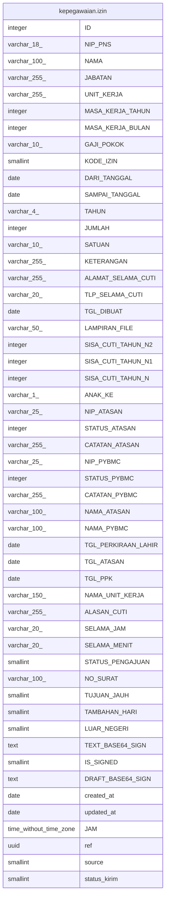

# kepegawaian.izin

## Description

## Columns

| Name | Type | Default | Nullable | Children | Parents | Comment |
| ---- | ---- | ------- | -------- | -------- | ------- | ------- |
| ID | integer | nextval('kepegawaian."izin_ID_seq"'::regclass) | false |  |  |  |
| NIP_PNS | varchar(18) |  | false |  |  |  |
| NAMA | varchar(100) |  | true |  |  |  |
| JABATAN | varchar(255) |  | true |  |  |  |
| UNIT_KERJA | varchar(255) |  | true |  |  |  |
| MASA_KERJA_TAHUN | integer |  | true |  |  |  |
| MASA_KERJA_BULAN | integer |  | true |  |  |  |
| GAJI_POKOK | varchar(10) |  | true |  |  |  |
| KODE_IZIN | smallint |  | false |  |  |  |
| DARI_TANGGAL | date |  | true |  |  |  |
| SAMPAI_TANGGAL | date |  | true |  |  |  |
| TAHUN | varchar(4) |  | true |  |  |  |
| JUMLAH | integer |  | true |  |  |  |
| SATUAN | varchar(10) |  | true |  |  |  |
| KETERANGAN | varchar(255) |  | true |  |  |  |
| ALAMAT_SELAMA_CUTI | varchar(255) |  | true |  |  |  |
| TLP_SELAMA_CUTI | varchar(20) |  | true |  |  |  |
| TGL_DIBUAT | date |  | true |  |  |  |
| LAMPIRAN_FILE | varchar(50) |  | true |  |  |  |
| SISA_CUTI_TAHUN_N2 | integer |  | true |  |  |  |
| SISA_CUTI_TAHUN_N1 | integer |  | true |  |  |  |
| SISA_CUTI_TAHUN_N | integer |  | true |  |  |  |
| ANAK_KE | varchar(1) |  | true |  |  |  |
| NIP_ATASAN | varchar(25) |  | true |  |  |  |
| STATUS_ATASAN | integer |  | true |  |  |  |
| CATATAN_ATASAN | varchar(255) |  | true |  |  |  |
| NIP_PYBMC | varchar(25) |  | true |  |  |  |
| STATUS_PYBMC | integer |  | true |  |  |  |
| CATATAN_PYBMC | varchar(255) |  | true |  |  |  |
| NAMA_ATASAN | varchar(100) |  | true |  |  |  |
| NAMA_PYBMC | varchar(100) |  | true |  |  |  |
| TGL_PERKIRAAN_LAHIR | date |  | true |  |  |  |
| TGL_ATASAN | date |  | true |  |  |  |
| TGL_PPK | date |  | true |  |  |  |
| NAMA_UNIT_KERJA | varchar(150) |  | true |  |  |  |
| ALASAN_CUTI | varchar(255) |  | true |  |  |  |
| SELAMA_JAM | varchar(20) |  | true |  |  |  |
| SELAMA_MENIT | varchar(20) |  | true |  |  |  |
| STATUS_PENGAJUAN | smallint | 1 | true |  |  | 1=menunggu persetujuan |
| NO_SURAT | varchar(100) |  | true |  |  |  |
| TUJUAN_JAUH | smallint |  | true |  |  |  |
| TAMBAHAN_HARI | smallint |  | true |  |  |  |
| LUAR_NEGERI | smallint | 0 | true |  |  | 0 = dalam negeri/null, 1= luar negeri |
| TEXT_BASE64_SIGN | text |  | true |  |  |  |
| IS_SIGNED | smallint |  | true |  |  | 0 |
| DRAFT_BASE64_SIGN | text |  | true |  |  |  |
| created_at | date |  | true |  |  |  |
| updated_at | date |  | true |  |  |  |
| JAM | time without time zone |  | true |  |  |  |
| ref | uuid |  | true |  |  |  |
| source | smallint | 1 | true |  |  | 1=web,2=mobile |
| status_kirim | smallint |  | true |  |  | 1=sudah pernah dikirim ke ekejadiran |

## Constraints

| Name | Type | Definition |
| ---- | ---- | ---------- |
| pk_izin | PRIMARY KEY | PRIMARY KEY ("ID") |

## Indexes

| Name | Definition |
| ---- | ---------- |
| pk_izin | CREATE UNIQUE INDEX pk_izin ON kepegawaian.izin USING btree ("ID") |

## Relations

---

> Generated by [tbls](https://github.com/k1LoW/tbls)
