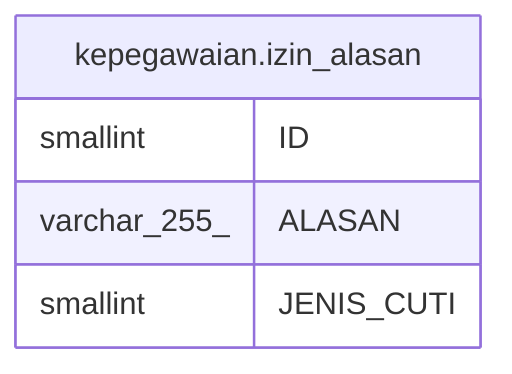

# kepegawaian.izin_alasan

## Description

## Columns

| Name | Type | Default | Nullable | Children | Parents | Comment |
| ---- | ---- | ------- | -------- | -------- | ------- | ------- |
| ID | smallint | nextval('kepegawaian."izin_alasan_ID_seq"'::regclass) | false |  |  |  |
| ALASAN | varchar(255) |  | true |  |  |  |
| JENIS_CUTI | smallint |  | true |  |  |  |

## Constraints

| Name | Type | Definition |
| ---- | ---- | ---------- |
| izin_alasan_pkey | PRIMARY KEY | PRIMARY KEY ("ID") |

## Indexes

| Name | Definition |
| ---- | ---------- |
| izin_alasan_pkey | CREATE UNIQUE INDEX izin_alasan_pkey ON kepegawaian.izin_alasan USING btree ("ID") |

## Relations

---

> Generated by [tbls](https://github.com/k1LoW/tbls)
