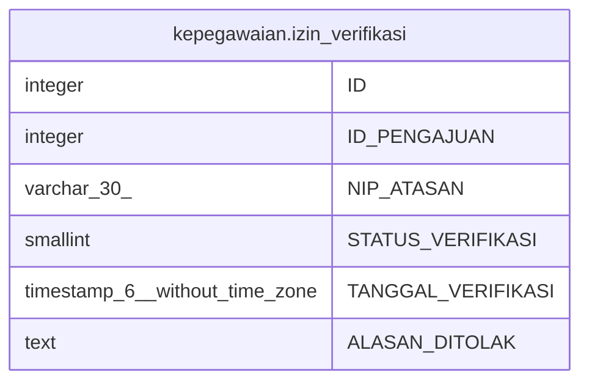

# kepegawaian.izin_verifikasi

## Description

## Columns

| Name | Type | Default | Nullable | Children | Parents | Comment |
| ---- | ---- | ------- | -------- | -------- | ------- | ------- |
| ID | integer | nextval('kepegawaian."izin_verifikasi_ID_seq"'::regclass) | false |  |  |  |
| ID_PENGAJUAN | integer |  | true |  |  |  |
| NIP_ATASAN | varchar(30) |  | true |  |  |  |
| STATUS_VERIFIKASI | smallint |  | true |  |  | 'id'=\>1,'value'=\>'Menunggu Persetujuan'), 			array('id'=\>2,'value'=\>'Proses'), 			array('id'=\>3,'value'=\>'Disetujui'), 			array('id'=\>4,'value'=\>'Perubahan'), 			array('id'=\>5,'value'=\>'Ditangguhkan'), 			array('id'=\>6,'value'=\>'Ditolak' |
| TANGGAL_VERIFIKASI | timestamp(6) without time zone |  | true |  |  |  |
| ALASAN_DITOLAK | text |  | true |  |  |  |

## Constraints

| Name | Type | Definition |
| ---- | ---- | ---------- |
| izin_verifikasi_pkey | PRIMARY KEY | PRIMARY KEY ("ID") |

## Indexes

| Name | Definition |
| ---- | ---------- |
| izin_verifikasi_pkey | CREATE UNIQUE INDEX izin_verifikasi_pkey ON kepegawaian.izin_verifikasi USING btree ("ID") |

## Relations

---

> Generated by [tbls](https://github.com/k1LoW/tbls)
