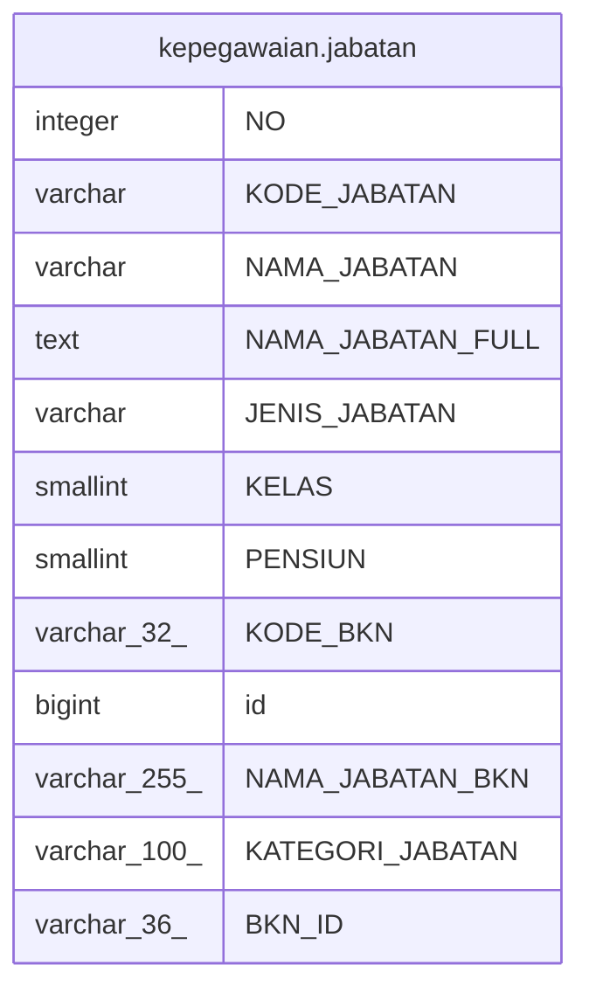

# kepegawaian.jabatan

## Description

## Columns

| Name | Type | Default | Nullable | Children | Parents | Comment |
| ---- | ---- | ------- | -------- | -------- | ------- | ------- |
| NO | integer | nextval('kepegawaian."jabatan_No_seq"'::regclass) | false |  |  |  |
| KODE_JABATAN | varchar |  | false |  |  |  |
| NAMA_JABATAN | varchar |  | true |  |  |  |
| NAMA_JABATAN_FULL | text |  | true |  |  |  |
| JENIS_JABATAN | varchar |  | true |  |  |  |
| KELAS | smallint |  | true |  |  |  |
| PENSIUN | smallint |  | true |  |  |  |
| KODE_BKN | varchar(32) |  | true |  |  |  |
| id | bigint | nextval('kepegawaian.jabatan_id_seq'::regclass) | false |  |  |  |
| NAMA_JABATAN_BKN | varchar(255) |  | true |  |  |  |
| KATEGORI_JABATAN | varchar(100) |  | true |  |  |  |
| BKN_ID | varchar(36) |  | true |  |  |  |

## Constraints

| Name | Type | Definition |
| ---- | ---- | ---------- |
| jabatan_pkey | PRIMARY KEY | PRIMARY KEY ("KODE_JABATAN") |

## Indexes

| Name | Definition |
| ---- | ---------- |
| jabatan_pkey | CREATE UNIQUE INDEX jabatan_pkey ON kepegawaian.jabatan USING btree ("KODE_JABATAN") |

## Relations

---

> Generated by [tbls](https://github.com/k1LoW/tbls)
