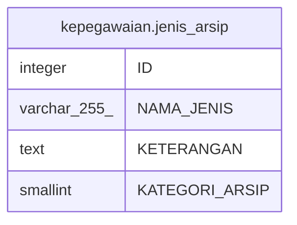

# kepegawaian.jenis_arsip

## Description

## Columns

| Name | Type | Default | Nullable | Children | Parents | Comment |
| ---- | ---- | ------- | -------- | -------- | ------- | ------- |
| ID | integer | nextval('kepegawaian.jenis_arsip_id_seq'::regclass) | false |  |  |  |
| NAMA_JENIS | varchar(255) |  | true |  |  | exa : ijazah SD, SK CPNS, SK PNS |
| KETERANGAN | text |  | true |  |  |  |
| KATEGORI_ARSIP | smallint |  | true |  |  |  |

## Constraints

| Name | Type | Definition |
| ---- | ---- | ---------- |
| jenis_arsip_pkey | PRIMARY KEY | PRIMARY KEY ("ID") |

## Indexes

| Name | Definition |
| ---- | ---------- |
| jenis_arsip_pkey | CREATE UNIQUE INDEX jenis_arsip_pkey ON kepegawaian.jenis_arsip USING btree ("ID") |

## Relations

---

> Generated by [tbls](https://github.com/k1LoW/tbls)
