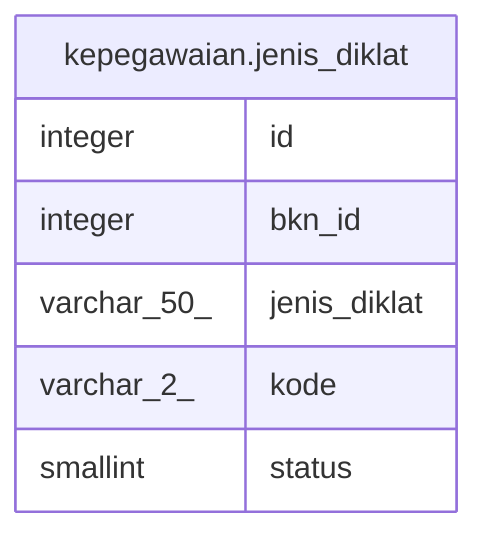

# kepegawaian.jenis_diklat

## Description

## Columns

| Name | Type | Default | Nullable | Children | Parents | Comment |
| ---- | ---- | ------- | -------- | -------- | ------- | ------- |
| id | integer | nextval('kepegawaian.jenis_diklat_id_seq'::regclass) | false |  |  |  |
| bkn_id | integer |  | true |  |  |  |
| jenis_diklat | varchar(50) |  | true |  |  |  |
| kode | varchar(2) |  | true |  |  |  |
| status | smallint | 1 | true |  |  |  |

## Constraints

| Name | Type | Definition |
| ---- | ---- | ---------- |
| jenis_diklat_pkey | PRIMARY KEY | PRIMARY KEY (id) |

## Indexes

| Name | Definition |
| ---- | ---------- |
| jenis_diklat_pkey | CREATE UNIQUE INDEX jenis_diklat_pkey ON kepegawaian.jenis_diklat USING btree (id) |

## Relations

---

> Generated by [tbls](https://github.com/k1LoW/tbls)
