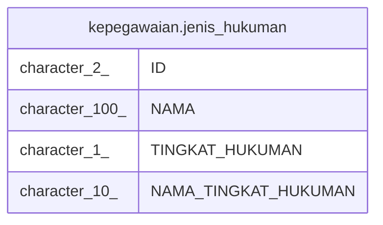

# kepegawaian.jenis_hukuman

## Description

## Columns

| Name | Type | Default | Nullable | Children | Parents | Comment |
| ---- | ---- | ------- | -------- | -------- | ------- | ------- |
| ID | character(2) |  | true |  |  |  |
| NAMA | character(100) |  | true |  |  |  |
| TINGKAT_HUKUMAN | character(1) |  | true |  |  |  |
| NAMA_TINGKAT_HUKUMAN | character(10) |  | true |  |  |  |

## Relations

---

> Generated by [tbls](https://github.com/k1LoW/tbls)
