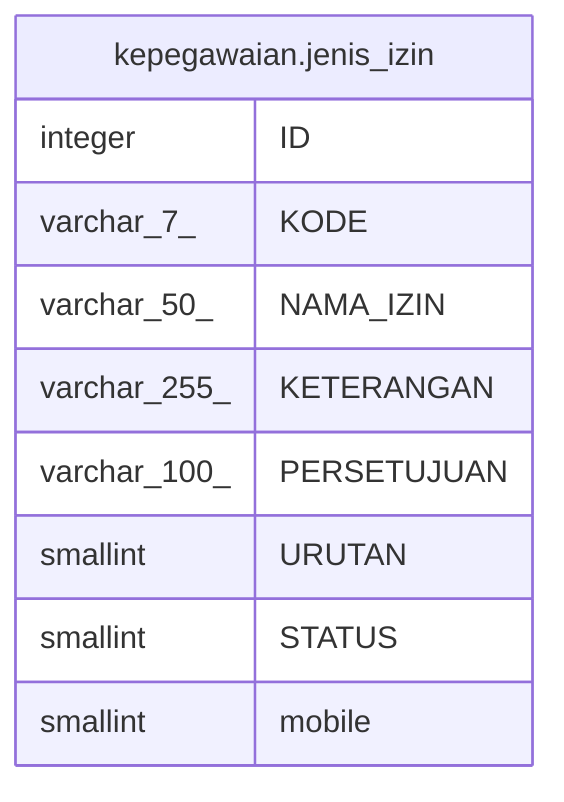

# kepegawaian.jenis_izin

## Description

## Columns

| Name | Type | Default | Nullable | Children | Parents | Comment |
| ---- | ---- | ------- | -------- | -------- | ------- | ------- |
| ID | integer | nextval('kepegawaian."jenis_izin_ID_seq"'::regclass) | false |  |  |  |
| KODE | varchar(7) |  | false |  |  |  |
| NAMA_IZIN | varchar(50) |  | false |  |  |  |
| KETERANGAN | varchar(255) |  | true |  |  |  |
| PERSETUJUAN | varchar(100) |  | true |  |  |  |
| URUTAN | smallint |  | true |  |  |  |
| STATUS | smallint | 1 | true |  |  |  |
| mobile | smallint | 0 | true |  |  |  |

## Constraints

| Name | Type | Definition |
| ---- | ---- | ---------- |
| pk_jenis_izin | PRIMARY KEY | PRIMARY KEY ("ID") |

## Indexes

| Name | Definition |
| ---- | ---------- |
| pk_jenis_izin | CREATE UNIQUE INDEX pk_jenis_izin ON kepegawaian.jenis_izin USING btree ("ID") |

## Relations

---

> Generated by [tbls](https://github.com/k1LoW/tbls)
