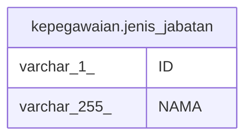

# kepegawaian.jenis_jabatan

## Description

## Columns

| Name | Type | Default | Nullable | Children | Parents | Comment |
| ---- | ---- | ------- | -------- | -------- | ------- | ------- |
| ID | varchar(1) | nextval('kepegawaian.rwt_jenis_jabatan_id_seq'::regclass) | false |  |  |  |
| NAMA | varchar(255) |  | true |  |  |  |

## Constraints

| Name | Type | Definition |
| ---- | ---- | ---------- |
| jenis_jabatan_pkey | PRIMARY KEY | PRIMARY KEY ("ID") |

## Indexes

| Name | Definition |
| ---- | ---------- |
| jenis_jabatan_pkey | CREATE UNIQUE INDEX jenis_jabatan_pkey ON kepegawaian.jenis_jabatan USING btree ("ID") |

## Relations

---

> Generated by [tbls](https://github.com/k1LoW/tbls)
