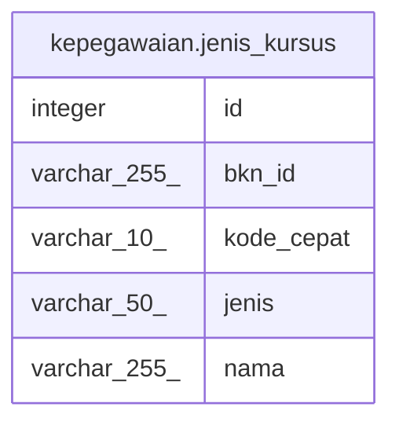

# kepegawaian.jenis_kursus

## Description

## Columns

| Name | Type | Default | Nullable | Children | Parents | Comment |
| ---- | ---- | ------- | -------- | -------- | ------- | ------- |
| id | integer | nextval('kepegawaian.jenis_kursus_id_seq'::regclass) | false |  |  |  |
| bkn_id | varchar(255) |  | true |  |  |  |
| kode_cepat | varchar(10) |  | true |  |  |  |
| jenis | varchar(50) |  | true |  |  |  |
| nama | varchar(255) |  | true |  |  |  |

## Constraints

| Name | Type | Definition |
| ---- | ---- | ---------- |
| jenis_kursus_pkey | PRIMARY KEY | PRIMARY KEY (id) |

## Indexes

| Name | Definition |
| ---- | ---------- |
| jenis_kursus_pkey | CREATE UNIQUE INDEX jenis_kursus_pkey ON kepegawaian.jenis_kursus USING btree (id) |

## Relations

---

> Generated by [tbls](https://github.com/k1LoW/tbls)
