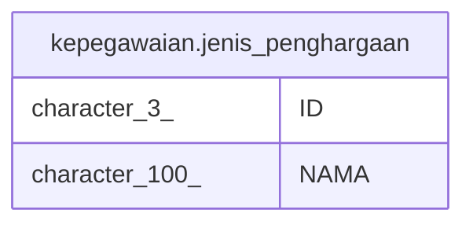

# kepegawaian.jenis_penghargaan

## Description

## Columns

| Name | Type | Default | Nullable | Children | Parents | Comment |
| ---- | ---- | ------- | -------- | -------- | ------- | ------- |
| ID | character(3) |  | false |  |  |  |
| NAMA | character(100) |  | true |  |  |  |

## Constraints

| Name | Type | Definition |
| ---- | ---- | ---------- |
| jenis_penghargaan_ID | PRIMARY KEY | PRIMARY KEY ("ID") |
| jenis_penghargaan_NAMA | UNIQUE | UNIQUE ("NAMA") |

## Indexes

| Name | Definition |
| ---- | ---------- |
| jenis_penghargaan_ID | CREATE UNIQUE INDEX "jenis_penghargaan_ID" ON kepegawaian.jenis_penghargaan USING btree ("ID") |
| jenis_penghargaan_NAMA | CREATE UNIQUE INDEX "jenis_penghargaan_NAMA" ON kepegawaian.jenis_penghargaan USING btree ("NAMA") |

## Relations

---

> Generated by [tbls](https://github.com/k1LoW/tbls)
