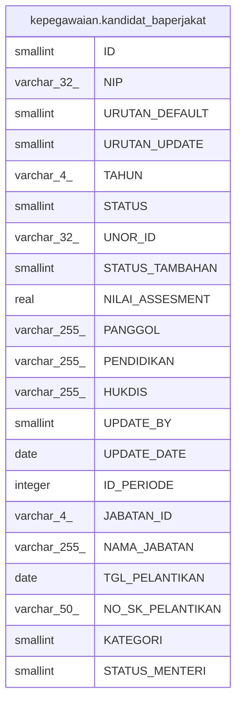

# kepegawaian.kandidat_baperjakat

## Description

## Columns

| Name | Type | Default | Nullable | Children | Parents | Comment |
| ---- | ---- | ------- | -------- | -------- | ------- | ------- |
| ID | smallint | nextval('kepegawaian."kandidat_baperjakat_ID_seq"'::regclass) | false |  |  |  |
| NIP | varchar(32) |  | true |  |  |  |
| URUTAN_DEFAULT | smallint |  | true |  |  |  |
| URUTAN_UPDATE | smallint |  | true |  |  |  |
| TAHUN | varchar(4) |  | true |  |  |  |
| STATUS | smallint |  | true |  |  | 1=diterima,0 tidak diterima |
| UNOR_ID | varchar(32) |  | true |  |  |  |
| STATUS_TAMBAHAN | smallint |  | true |  |  | 1=admin, 2= sistem |
| NILAI_ASSESMENT | real |  | true |  |  |  |
| PANGGOL | varchar(255) |  | true |  |  |  |
| PENDIDIKAN | varchar(255) |  | true |  |  |  |
| HUKDIS | varchar(255) |  | true |  |  |  |
| UPDATE_BY | smallint |  | true |  |  |  |
| UPDATE_DATE | date |  | true |  |  |  |
| ID_PERIODE | integer |  | true |  |  |  |
| JABATAN_ID | varchar(4) |  | true |  |  |  |
| NAMA_JABATAN | varchar(255) |  | true |  |  |  |
| TGL_PELANTIKAN | date |  | true |  |  |  |
| NO_SK_PELANTIKAN | varchar(50) |  | true |  |  |  |
| KATEGORI | smallint |  | true |  |  | 1=rotasi,2=promosi |
| STATUS_MENTERI | smallint |  | true |  |  |  |

## Constraints

| Name | Type | Definition |
| ---- | ---- | ---------- |
| kandidat_baperjakat_pkey | PRIMARY KEY | PRIMARY KEY ("ID") |

## Indexes

| Name | Definition |
| ---- | ---------- |
| kandidat_baperjakat_pkey | CREATE UNIQUE INDEX kandidat_baperjakat_pkey ON kepegawaian.kandidat_baperjakat USING btree ("ID") |

## Relations

---

> Generated by [tbls](https://github.com/k1LoW/tbls)
