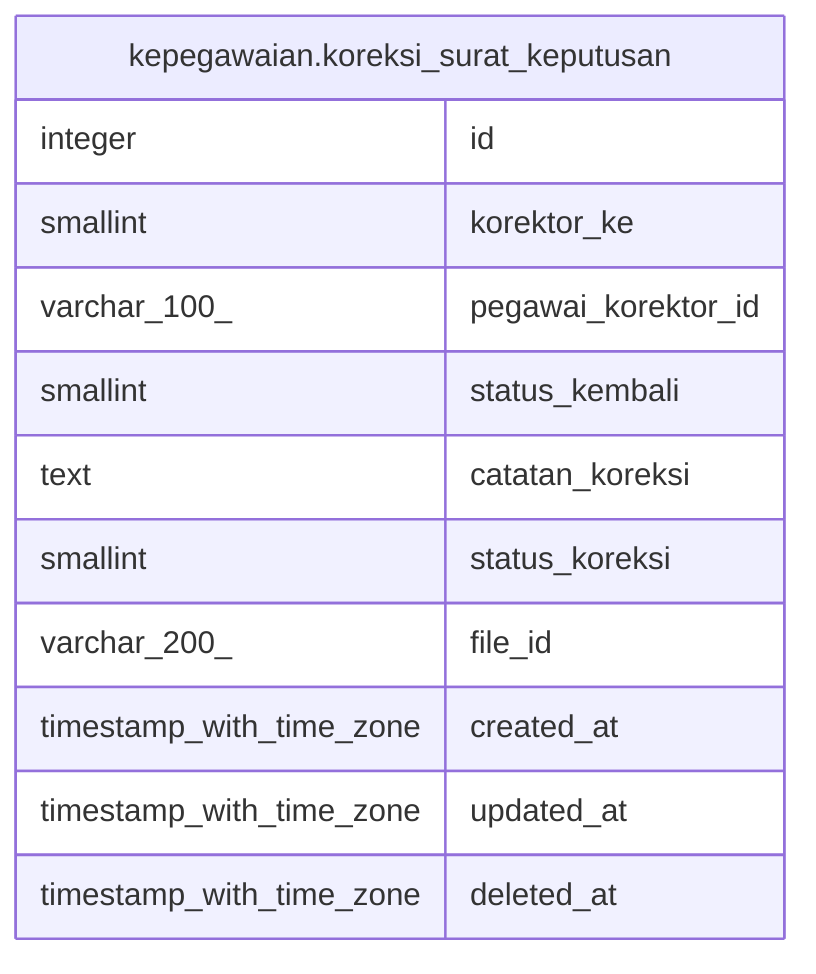

# kepegawaian.koreksi_surat_keputusan

## Description

## Columns

| Name | Type | Default | Nullable | Children | Parents | Comment |
| ---- | ---- | ------- | -------- | -------- | ------- | ------- |
| id | integer | nextval('file_digital_signature_corrector_id_seq1'::regclass) | false |  |  |  |
| korektor_ke | smallint |  | true |  |  |  |
| pegawai_korektor_id | varchar(100) |  | true |  |  |  |
| status_kembali | smallint |  | true |  |  | 1=dikembalikan, 0/null = sudah oke |
| catatan_koreksi | text |  | true |  |  |  |
| status_koreksi | smallint |  | true |  |  | 1=koreksi ok, 2=siap koreksi, 0/null = masih antrian |
| file_id | varchar(200) |  | true |  |  |  |
| created_at | timestamp with time zone | now() | true |  |  |  |
| updated_at | timestamp with time zone | now() | true |  |  |  |
| deleted_at | timestamp with time zone |  | true |  |  |  |

## Constraints

| Name | Type | Definition |
| ---- | ---- | ---------- |
| file_digital_signature_corrector_pkey | PRIMARY KEY | PRIMARY KEY (id) |

## Indexes

| Name | Definition |
| ---- | ---------- |
| file_digital_signature_corrector_pkey | CREATE UNIQUE INDEX file_digital_signature_corrector_pkey ON kepegawaian.koreksi_surat_keputusan USING btree (id) |

## Relations

---

> Generated by [tbls](https://github.com/k1LoW/tbls)
