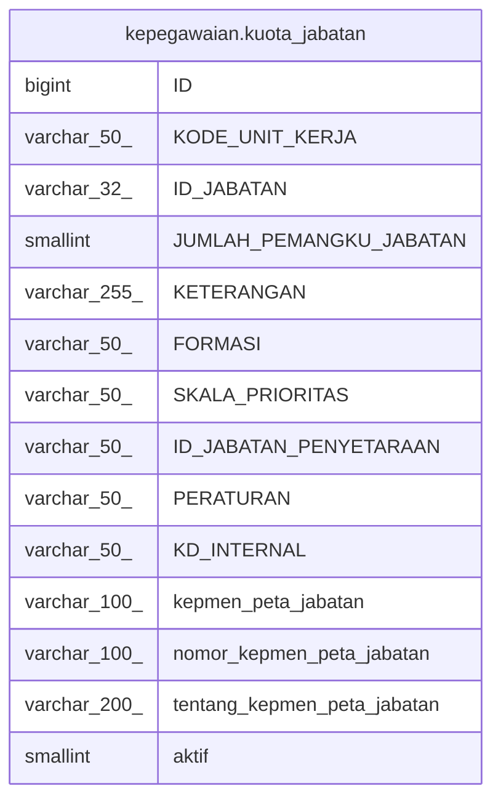

# kepegawaian.kuota_jabatan

## Description

## Columns

| Name | Type | Default | Nullable | Children | Parents | Comment |
| ---- | ---- | ------- | -------- | -------- | ------- | ------- |
| ID | bigint | nextval('kepegawaian.kuota_jabatan_id_seq'::regclass) | false |  |  |  |
| KODE_UNIT_KERJA | varchar(50) |  | true |  |  |  |
| ID_JABATAN | varchar(32) |  | true |  |  |  |
| JUMLAH_PEMANGKU_JABATAN | smallint |  | true |  |  |  |
| KETERANGAN | varchar(255) |  | true |  |  |  |
| FORMASI | varchar(50) |  | true |  |  |  |
| SKALA_PRIORITAS | varchar(50) |  | true |  |  |  |
| ID_JABATAN_PENYETARAAN | varchar(50) |  | true |  |  |  |
| PERATURAN | varchar(50) |  | true |  |  |  |
| KD_INTERNAL | varchar(50) |  | true |  |  |  |
| kepmen_peta_jabatan | varchar(100) |  | true |  |  |  |
| nomor_kepmen_peta_jabatan | varchar(100) |  | true |  |  |  |
| tentang_kepmen_peta_jabatan | varchar(200) |  | true |  |  |  |
| aktif | smallint |  | true |  |  |  |

## Relations

---

> Generated by [tbls](https://github.com/k1LoW/tbls)
