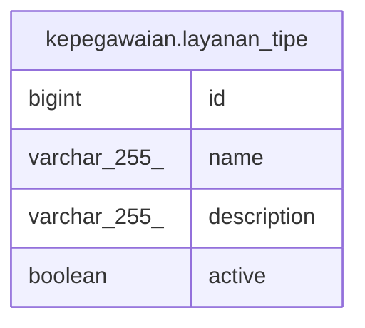

# kepegawaian.layanan_tipe

## Description

## Columns

| Name | Type | Default | Nullable | Children | Parents | Comment |
| ---- | ---- | ------- | -------- | -------- | ------- | ------- |
| id | bigint | nextval('kepegawaian.layanan_id_seq'::regclass) | false |  |  |  |
| name | varchar(255) |  | true |  |  |  |
| description | varchar(255) |  | true |  |  |  |
| active | boolean |  | true |  |  |  |

## Constraints

| Name | Type | Definition |
| ---- | ---- | ---------- |
| layanan_pkey | PRIMARY KEY | PRIMARY KEY (id) |

## Indexes

| Name | Definition |
| ---- | ---------- |
| layanan_pkey | CREATE UNIQUE INDEX layanan_pkey ON kepegawaian.layanan_tipe USING btree (id) |

## Relations

---

> Generated by [tbls](https://github.com/k1LoW/tbls)
