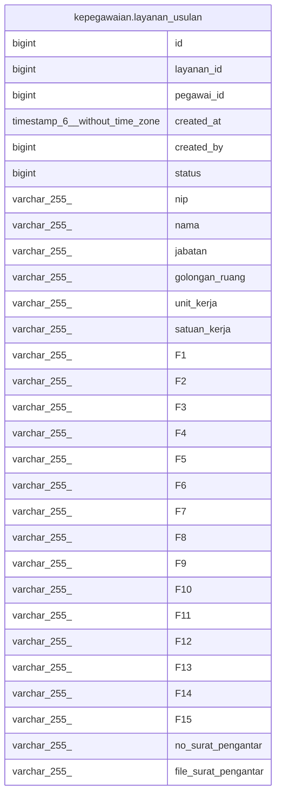

# kepegawaian.layanan_usulan

## Description

## Columns

| Name | Type | Default | Nullable | Children | Parents | Comment |
| ---- | ---- | ------- | -------- | -------- | ------- | ------- |
| id | bigint | nextval('kepegawaian.layanan_usulan_id_seq'::regclass) | false |  |  |  |
| layanan_id | bigint |  | true |  |  |  |
| pegawai_id | bigint |  | true |  |  |  |
| created_at | timestamp(6) without time zone |  | true |  |  |  |
| created_by | bigint |  | true |  |  |  |
| status | bigint |  | true |  |  |  |
| nip | varchar(255) |  | true |  |  |  |
| nama | varchar(255) |  | true |  |  |  |
| jabatan | varchar(255) |  | true |  |  |  |
| golongan_ruang | varchar(255) |  | true |  |  |  |
| unit_kerja | varchar(255) |  | true |  |  |  |
| satuan_kerja | varchar(255) |  | true |  |  |  |
| F1 | varchar(255) |  | true |  |  |  |
| F2 | varchar(255) |  | true |  |  |  |
| F3 | varchar(255) |  | true |  |  |  |
| F4 | varchar(255) |  | true |  |  |  |
| F5 | varchar(255) |  | true |  |  |  |
| F6 | varchar(255) |  | true |  |  |  |
| F7 | varchar(255) |  | true |  |  |  |
| F8 | varchar(255) |  | true |  |  |  |
| F9 | varchar(255) |  | true |  |  |  |
| F10 | varchar(255) |  | true |  |  |  |
| F11 | varchar(255) |  | true |  |  |  |
| F12 | varchar(255) |  | true |  |  |  |
| F13 | varchar(255) |  | true |  |  |  |
| F14 | varchar(255) |  | true |  |  |  |
| F15 | varchar(255) |  | true |  |  |  |
| no_surat_pengantar | varchar(255) |  | true |  |  |  |
| file_surat_pengantar | varchar(255) |  | true |  |  |  |

## Constraints

| Name | Type | Definition |
| ---- | ---- | ---------- |
| layanan_usulan_pkey | PRIMARY KEY | PRIMARY KEY (id) |

## Indexes

| Name | Definition |
| ---- | ---------- |
| layanan_usulan_pkey | CREATE UNIQUE INDEX layanan_usulan_pkey ON kepegawaian.layanan_usulan USING btree (id) |

## Relations

---

> Generated by [tbls](https://github.com/k1LoW/tbls)
