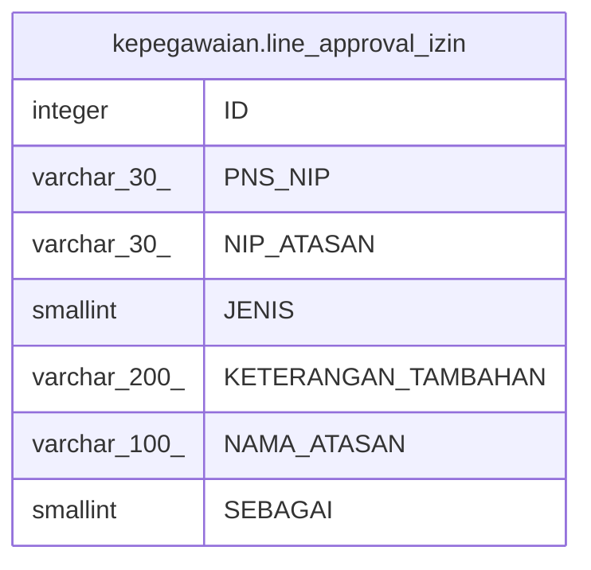

# kepegawaian.line_approval_izin

## Description

## Columns

| Name | Type | Default | Nullable | Children | Parents | Comment |
| ---- | ---- | ------- | -------- | -------- | ------- | ------- |
| ID | integer | nextval('kepegawaian."line_approval_izin_ID_seq"'::regclass) | false |  |  |  |
| PNS_NIP | varchar(30) |  | true |  |  |  |
| NIP_ATASAN | varchar(30) |  | true |  |  |  |
| JENIS | smallint |  | true |  |  | 1=ATASAN LANGSUNG, 2 = PPK |
| KETERANGAN_TAMBAHAN | varchar(200) |  | true |  |  |  |
| NAMA_ATASAN | varchar(100) |  | true |  |  |  |
| SEBAGAI | smallint |  | true |  |  | 1,2,3,4 |

## Constraints

| Name | Type | Definition |
| ---- | ---- | ---------- |
| line_approval_izin_pkey | PRIMARY KEY | PRIMARY KEY ("ID") |

## Indexes

| Name | Definition |
| ---- | ---------- |
| line_approval_izin_pkey | CREATE UNIQUE INDEX line_approval_izin_pkey ON kepegawaian.line_approval_izin USING btree ("ID") |

## Relations

---

> Generated by [tbls](https://github.com/k1LoW/tbls)
