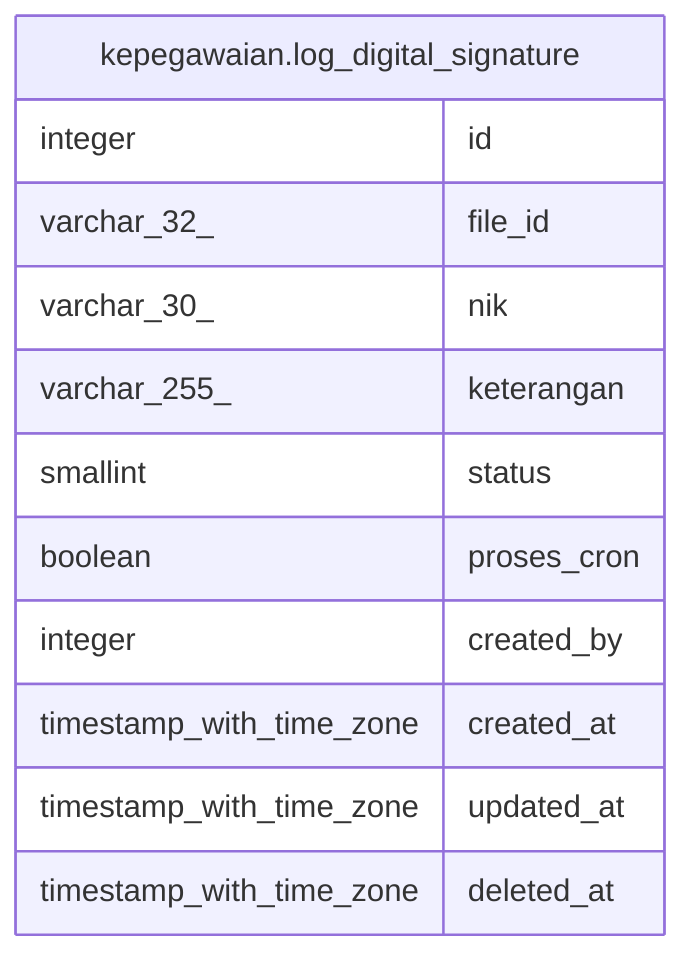

# kepegawaian.log_digital_signature

## Description

## Columns

| Name | Type | Default | Nullable | Children | Parents | Comment |
| ---- | ---- | ------- | -------- | -------- | ------- | ------- |
| id | integer | nextval('log_digital_signature_id_seq'::regclass) | false |  |  |  |
| file_id | varchar(32) |  | true |  |  |  |
| nik | varchar(30) |  | true |  |  |  |
| keterangan | varchar(255) |  | true |  |  |  |
| status | smallint |  | true |  |  | 1:gagal, 2:berhasil |
| proses_cron | boolean | false | true |  |  | 0 = belum, 1 = sudah |
| created_by | integer |  | true |  |  |  |
| created_at | timestamp with time zone | now() | true |  |  |  |
| updated_at | timestamp with time zone | now() | true |  |  |  |
| deleted_at | timestamp with time zone |  | true |  |  |  |

## Constraints

| Name | Type | Definition |
| ---- | ---- | ---------- |
| log_digital_signature_pkey | PRIMARY KEY | PRIMARY KEY (id) |

## Indexes

| Name | Definition |
| ---- | ---------- |
| log_digital_signature_pkey | CREATE UNIQUE INDEX log_digital_signature_pkey ON kepegawaian.log_digital_signature USING btree (id) |

## Relations

---

> Generated by [tbls](https://github.com/k1LoW/tbls)
