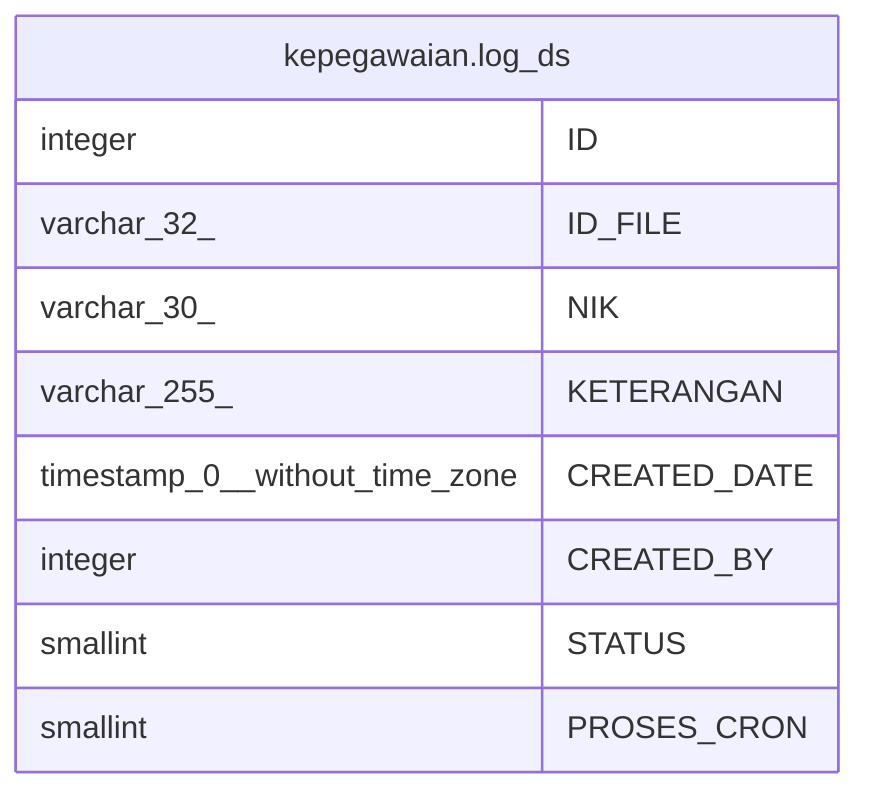

# kepegawaian.log_ds

## Description

## Columns

| Name | Type | Default | Nullable | Children | Parents | Comment |
| ---- | ---- | ------- | -------- | -------- | ------- | ------- |
| ID | integer | nextval('kepegawaian."log_ds_ID_seq"'::regclass) | false |  |  |  |
| ID_FILE | varchar(32) |  | true |  |  |  |
| NIK | varchar(30) |  | true |  |  |  |
| KETERANGAN | varchar(255) |  | true |  |  |  |
| CREATED_DATE | timestamp(0) without time zone |  | true |  |  |  |
| CREATED_BY | integer |  | true |  |  |  |
| STATUS | smallint |  | true |  |  | 1:gagal, 2:berhasil |
| PROSES_CRON | smallint | 0 | true |  |  | 0 = belum, 1 = sudah |

## Constraints

| Name | Type | Definition |
| ---- | ---- | ---------- |
| log_ds_pkey | PRIMARY KEY | PRIMARY KEY ("ID") |

## Indexes

| Name | Definition |
| ---- | ---------- |
| log_ds_pkey | CREATE UNIQUE INDEX log_ds_pkey ON kepegawaian.log_ds USING btree ("ID") |

## Relations

---

> Generated by [tbls](https://github.com/k1LoW/tbls)
