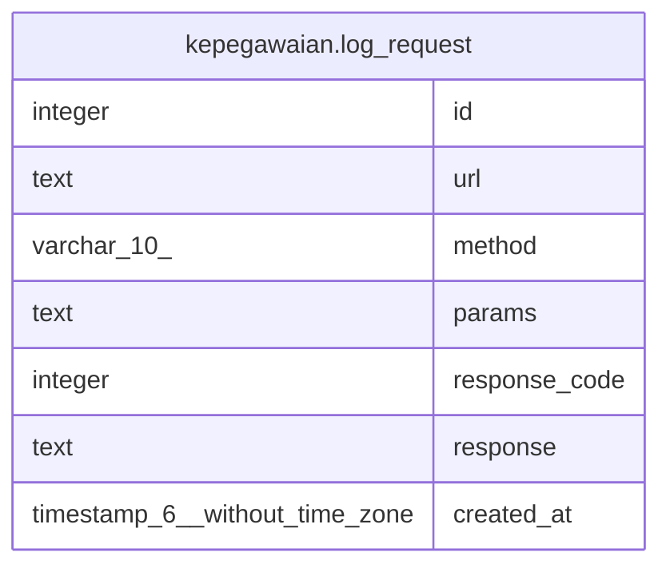

# kepegawaian.log_request

## Description

## Columns

| Name | Type | Default | Nullable | Children | Parents | Comment |
| ---- | ---- | ------- | -------- | -------- | ------- | ------- |
| id | integer | nextval('kepegawaian.log_request_id_seq'::regclass) | false |  |  |  |
| url | text |  | false |  |  |  |
| method | varchar(10) |  | true |  |  |  |
| params | text |  | true |  |  |  |
| response_code | integer |  | true |  |  |  |
| response | text |  | true |  |  |  |
| created_at | timestamp(6) without time zone | now() | true |  |  |  |

## Relations

---

> Generated by [tbls](https://github.com/k1LoW/tbls)
