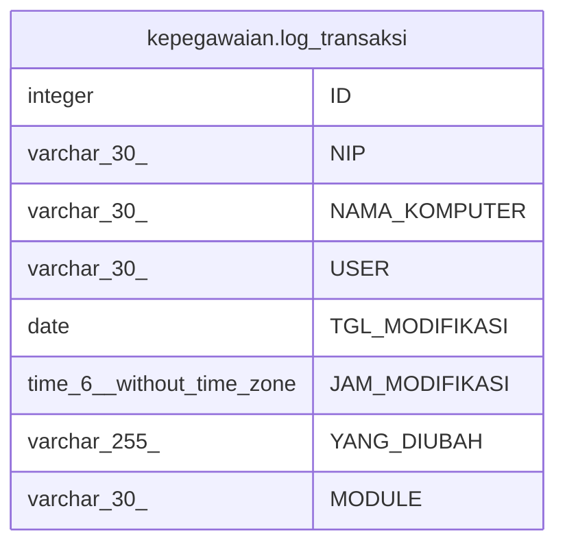

# kepegawaian.log_transaksi

## Description

## Columns

| Name | Type | Default | Nullable | Children | Parents | Comment |
| ---- | ---- | ------- | -------- | -------- | ------- | ------- |
| ID | integer | nextval('kepegawaian."log_transaksi_ID_seq"'::regclass) | false |  |  |  |
| NIP | varchar(30) |  | true |  |  |  |
| NAMA_KOMPUTER | varchar(30) |  | true |  |  |  |
| USER | varchar(30) |  | true |  |  |  |
| TGL_MODIFIKASI | date |  | true |  |  |  |
| JAM_MODIFIKASI | time(6) without time zone |  | true |  |  |  |
| YANG_DIUBAH | varchar(255) |  | true |  |  |  |
| MODULE | varchar(30) |  | true |  |  |  |

## Constraints

| Name | Type | Definition |
| ---- | ---- | ---------- |
| log_transaksi_pkey | PRIMARY KEY | PRIMARY KEY ("ID") |

## Indexes

| Name | Definition |
| ---- | ---------- |
| log_transaksi_pkey | CREATE UNIQUE INDEX log_transaksi_pkey ON kepegawaian.log_transaksi USING btree ("ID") |

## Relations

---

> Generated by [tbls](https://github.com/k1LoW/tbls)
