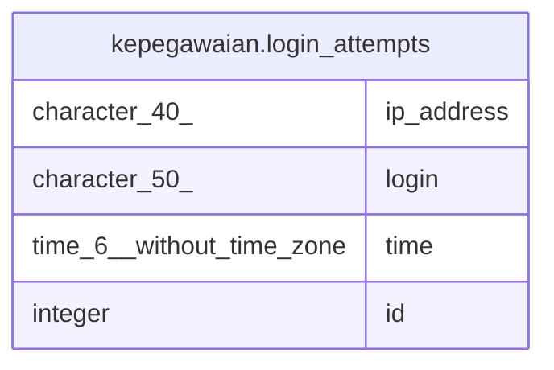

# kepegawaian.login_attempts

## Description

## Columns

| Name | Type | Default | Nullable | Children | Parents | Comment |
| ---- | ---- | ------- | -------- | -------- | ------- | ------- |
| ip_address | character(40) |  | false |  |  |  |
| login | character(50) |  | false |  |  |  |
| time | time(6) without time zone |  | true |  |  |  |
| id | integer | nextval('kepegawaian.login_attempts_id_seq'::regclass) | false |  |  |  |

## Constraints

| Name | Type | Definition |
| ---- | ---- | ---------- |
| login_attempts_pkey | PRIMARY KEY | PRIMARY KEY (id) |

## Indexes

| Name | Definition |
| ---- | ---------- |
| login_attempts_pkey | CREATE UNIQUE INDEX login_attempts_pkey ON kepegawaian.login_attempts USING btree (id) |

## Relations

---

> Generated by [tbls](https://github.com/k1LoW/tbls)
