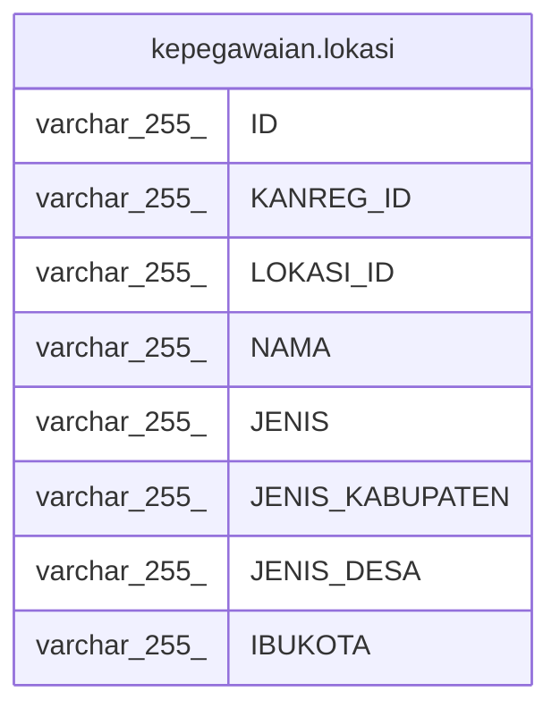

# kepegawaian.lokasi

## Description

## Columns

| Name | Type | Default | Nullable | Children | Parents | Comment |
| ---- | ---- | ------- | -------- | -------- | ------- | ------- |
| ID | varchar(255) |  | false |  |  |  |
| KANREG_ID | varchar(255) |  | true |  |  |  |
| LOKASI_ID | varchar(255) |  | true |  |  |  |
| NAMA | varchar(255) |  | true |  |  |  |
| JENIS | varchar(255) |  | true |  |  |  |
| JENIS_KABUPATEN | varchar(255) |  | true |  |  |  |
| JENIS_DESA | varchar(255) |  | true |  |  |  |
| IBUKOTA | varchar(255) |  | true |  |  |  |

## Constraints

| Name | Type | Definition |
| ---- | ---- | ---------- |
| lokasi_pkey | PRIMARY KEY | PRIMARY KEY ("ID") |

## Indexes

| Name | Definition |
| ---- | ---------- |
| lokasi_pkey | CREATE UNIQUE INDEX lokasi_pkey ON kepegawaian.lokasi USING btree ("ID") |

## Relations

---

> Generated by [tbls](https://github.com/k1LoW/tbls)
