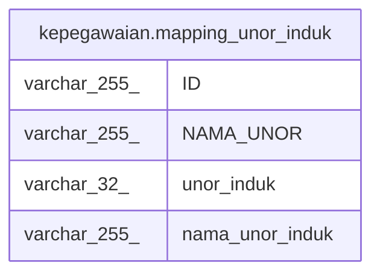

# kepegawaian.mapping_unor_induk

## Description

<details>
<summary><strong>Table Definition</strong></summary>

```sql
CREATE VIEW mapping_unor_induk AS (
 SELECT "ID",
    "NAMA_UNOR",
        CASE
            WHEN (("ESELON_2" IS NULL) OR (btrim(("ESELON_2")::text) = ''::text)) THEN "ESELON_1"
            WHEN (btrim(("NAMA_UNOR_ESELON_1")::text) = 'universitas_dikti'::text) THEN "ESELON_2"
            WHEN ((btrim(("NAMA_UNOR_ESELON_1")::text) = 'Sekretariat Jenderal'::text) AND (btrim(("NAMA_UNOR_ESELON_2")::text) = 'Pusat Data dan Teknologi Informasi'::text) AND (btrim(("NAMA_UNOR_ESELON_3")::text) = 'Balai Pengembangan Multimedia Pendidikan dan Kebudayaan'::text)) THEN "ESELON_3"
            WHEN ((btrim(("NAMA_UNOR_ESELON_1")::text) = 'Sekretariat Jenderal'::text) AND (btrim(("NAMA_UNOR_ESELON_2")::text) = 'Pusat Data dan Teknologi Informasi'::text) AND (btrim(("NAMA_UNOR_ESELON_3")::text) = 'Balai Pengembangan Media Televisi Pendidikan dan Kebudayaan'::text)) THEN "ESELON_3"
            WHEN ((btrim(("NAMA_UNOR_ESELON_1")::text) = 'Sekretariat Jenderal'::text) AND (btrim(("NAMA_UNOR_ESELON_2")::text) = 'Pusat Data dan Teknologi Informasi'::text) AND (btrim(("NAMA_UNOR_ESELON_3")::text) = 'Balai Pengembangan Media Radio Pendidikan dan Kebudayaan'::text)) THEN "ESELON_3"
            ELSE "ESELON_2"
        END AS unor_induk,
        CASE
            WHEN (("ESELON_2" IS NULL) OR (btrim(("ESELON_2")::text) = ''::text)) THEN "NAMA_UNOR_ESELON_1"
            WHEN (btrim(("NAMA_UNOR_ESELON_1")::text) = 'universitas_dikti'::text) THEN "NAMA_UNOR_ESELON_2"
            WHEN ((btrim(("NAMA_UNOR_ESELON_1")::text) = 'Sekretariat Jenderal'::text) AND (btrim(("NAMA_UNOR_ESELON_2")::text) = 'Pusat Data dan Teknologi Informasi'::text) AND (btrim(("NAMA_UNOR_ESELON_3")::text) = 'Balai Pengembangan Multimedia Pendidikan dan Kebudayaan'::text)) THEN "NAMA_UNOR_ESELON_3"
            WHEN ((btrim(("NAMA_UNOR_ESELON_1")::text) = 'Sekretariat Jenderal'::text) AND (btrim(("NAMA_UNOR_ESELON_2")::text) = 'Pusat Data dan Teknologi Informasi'::text) AND (btrim(("NAMA_UNOR_ESELON_3")::text) = 'Balai Pengembangan Media Televisi Pendidikan dan Kebudayaan'::text)) THEN "NAMA_UNOR_ESELON_3"
            WHEN ((btrim(("NAMA_UNOR_ESELON_1")::text) = 'Sekretariat Jenderal'::text) AND (btrim(("NAMA_UNOR_ESELON_2")::text) = 'Pusat Data dan Teknologi Informasi'::text) AND (btrim(("NAMA_UNOR_ESELON_3")::text) = 'Balai Pengembangan Media Radio Pendidikan dan Kebudayaan'::text)) THEN "NAMA_UNOR_ESELON_3"
            ELSE "NAMA_UNOR_ESELON_2"
        END AS nama_unor_induk
   FROM kepegawaian.vw_unit_list t
)
```

</details>

## Columns

| Name | Type | Default | Nullable | Children | Parents | Comment |
| ---- | ---- | ------- | -------- | -------- | ------- | ------- |
| ID | varchar(255) |  | true |  |  |  |
| NAMA_UNOR | varchar(255) |  | true |  |  |  |
| unor_induk | varchar(32) |  | true |  |  |  |
| nama_unor_induk | varchar(255) |  | true |  |  |  |

## Referenced Tables

| Name | Columns | Comment | Type |
| ---- | ------- | ------- | ---- |
| [kepegawaian.vw_unit_list](kepegawaian.vw_unit_list.md) | 30 |  | MATERIALIZED VIEW |

## Relations



---

> Generated by [tbls](https://github.com/k1LoW/tbls)
