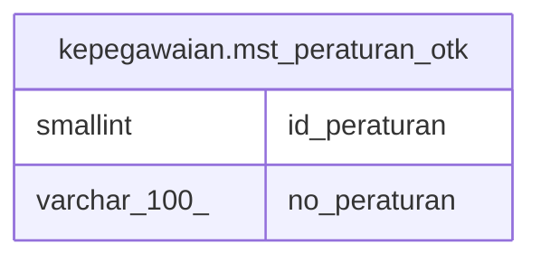

# kepegawaian.mst_peraturan_otk

## Description

## Columns

| Name | Type | Default | Nullable | Children | Parents | Comment |
| ---- | ---- | ------- | -------- | -------- | ------- | ------- |
| id_peraturan | smallint | nextval('kepegawaian.peraturan_otk_id_peraturan_seq'::regclass) | false |  |  |  |
| no_peraturan | varchar(100) |  | true |  |  |  |

## Constraints

| Name | Type | Definition |
| ---- | ---- | ---------- |
| peraturan_otk_pkey | PRIMARY KEY | PRIMARY KEY (id_peraturan) |

## Indexes

| Name | Definition |
| ---- | ---------- |
| peraturan_otk_pkey | CREATE UNIQUE INDEX peraturan_otk_pkey ON kepegawaian.mst_peraturan_otk USING btree (id_peraturan) |

## Relations

---

> Generated by [tbls](https://github.com/k1LoW/tbls)
