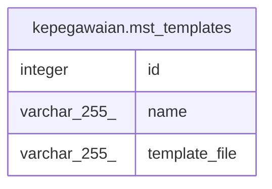

# kepegawaian.mst_templates

## Description

## Columns

| Name | Type | Default | Nullable | Children | Parents | Comment |
| ---- | ---- | ------- | -------- | -------- | ------- | ------- |
| id | integer | nextval('kepegawaian.mst_templates_id_seq'::regclass) | false |  |  |  |
| name | varchar(255) |  | true |  |  |  |
| template_file | varchar(255) |  | true |  |  |  |

## Constraints

| Name | Type | Definition |
| ---- | ---- | ---------- |
| mst_templates_pkey | PRIMARY KEY | PRIMARY KEY (id) |

## Indexes

| Name | Definition |
| ---- | ---------- |
| mst_templates_pkey | CREATE UNIQUE INDEX mst_templates_pkey ON kepegawaian.mst_templates USING btree (id) |

## Relations

---

> Generated by [tbls](https://github.com/k1LoW/tbls)
