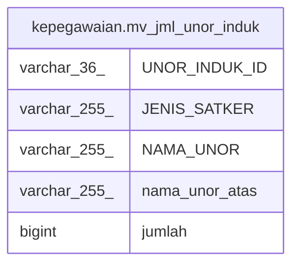

# kepegawaian.mv_jml_unor_induk

## Description

<details>
<summary><strong>Table Definition</strong></summary>

```sql
CREATE MATERIALIZED VIEW mv_jml_unor_induk AS (
 SELECT pegawai."UNOR_INDUK_ID",
    uk."JENIS_SATKER",
    uk."NAMA_UNOR",
    u."NAMA_UNOR" AS nama_unor_atas,
    count(pegawai."ID") AS jumlah
   FROM (((kepegawaian.pegawai pegawai
     LEFT JOIN kepegawaian.pns_aktif pa ON ((pegawai."ID" = pa."ID")))
     LEFT JOIN kepegawaian.unitkerja uk ON (((uk."ID")::text = (pegawai."UNOR_INDUK_ID")::text)))
     LEFT JOIN kepegawaian.unitkerja u ON (((u."ID")::text = (uk."DIATASAN_ID")::text)))
  WHERE (((pegawai."KEDUDUKAN_HUKUM_ID")::text <> ALL (ARRAY[('14'::character varying)::text, ('52'::character varying)::text, ('66'::character varying)::text, ('67'::character varying)::text, ('77'::character varying)::text, ('88'::character varying)::text, ('98'::character varying)::text, ('99'::character varying)::text, ('100'::character varying)::text])) AND ((pegawai.status_pegawai <> 3) OR (pegawai.status_pegawai IS NULL)) AND (pa."ID" IS NOT NULL))
  GROUP BY pegawai."UNOR_INDUK_ID", uk."JENIS_SATKER", uk."NAMA_UNOR", u."NAMA_UNOR"
  ORDER BY u."NAMA_UNOR", uk."NAMA_UNOR"
)
```

</details>

## Columns

| Name | Type | Default | Nullable | Children | Parents | Comment |
| ---- | ---- | ------- | -------- | -------- | ------- | ------- |
| UNOR_INDUK_ID | varchar(36) |  | true |  |  |  |
| JENIS_SATKER | varchar(255) |  | true |  |  |  |
| NAMA_UNOR | varchar(255) |  | true |  |  |  |
| nama_unor_atas | varchar(255) |  | true |  |  |  |
| jumlah | bigint |  | true |  |  |  |

## Referenced Tables

| Name | Columns | Comment | Type |
| ---- | ------- | ------- | ---- |
| [kepegawaian.pegawai](kepegawaian.pegawai.md) | 100 |  | BASE TABLE |
| [kepegawaian.pns_aktif](kepegawaian.pns_aktif.md) | 3 |  | VIEW |
| [kepegawaian.unitkerja](kepegawaian.unitkerja.md) | 30 |  | BASE TABLE |

## Relations



---

> Generated by [tbls](https://github.com/k1LoW/tbls)
