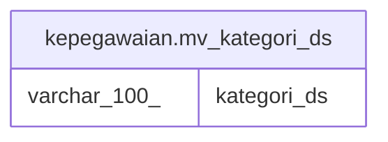

# kepegawaian.mv_kategori_ds

## Description

<details>
<summary><strong>Table Definition</strong></summary>

```sql
CREATE MATERIALIZED VIEW mv_kategori_ds AS (
 SELECT DISTINCT kategori AS kategori_ds
   FROM kepegawaian.tbl_file_ds
  ORDER BY kategori
)
```

</details>

## Columns

| Name | Type | Default | Nullable | Children | Parents | Comment |
| ---- | ---- | ------- | -------- | -------- | ------- | ------- |
| kategori_ds | varchar(100) |  | true |  |  |  |

## Referenced Tables

| Name | Columns | Comment | Type |
| ---- | ------- | ------- | ---- |
| [kepegawaian.tbl_file_ds](kepegawaian.tbl_file_ds.md) | 39 |  | BASE TABLE |

## Relations



---

> Generated by [tbls](https://github.com/k1LoW/tbls)
