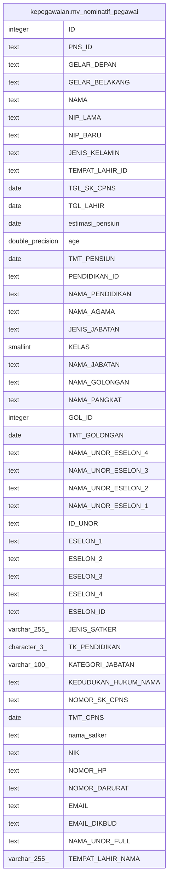

# kepegawaian.mv_nominatif_pegawai

## Description

<details>
<summary><strong>Table Definition</strong></summary>

```sql
CREATE MATERIALIZED VIEW mv_nominatif_pegawai AS (
 SELECT pegawai."ID",
    btrim((pegawai."PNS_ID")::text) AS "PNS_ID",
    btrim((pegawai."GELAR_DEPAN")::text) AS "GELAR_DEPAN",
    btrim((pegawai."GELAR_BELAKANG")::text) AS "GELAR_BELAKANG",
    btrim((pegawai."NAMA")::text) AS "NAMA",
    btrim((pegawai."NIP_LAMA")::text) AS "NIP_LAMA",
    btrim((pegawai."NIP_BARU")::text) AS "NIP_BARU",
    btrim((pegawai."JENIS_KELAMIN")::text) AS "JENIS_KELAMIN",
    btrim((pegawai."TEMPAT_LAHIR_ID")::text) AS "TEMPAT_LAHIR_ID",
    pegawai."TGL_SK_CPNS",
    pegawai."TGL_LAHIR",
    date((pegawai."TGL_LAHIR" + ('1 year'::interval * (jabatan."PENSIUN")::double precision))) AS estimasi_pensiun,
    date_part('year'::text, age((pegawai."TGL_LAHIR")::timestamp with time zone)) AS age,
    pegawai."TMT_PENSIUN",
    btrim((pegawai."PENDIDIKAN_ID")::text) AS "PENDIDIKAN_ID",
    btrim((pendidikan."NAMA")::text) AS "NAMA_PENDIDIKAN",
    btrim((agama."NAMA")::text) AS "NAMA_AGAMA",
    btrim((jenis_jabatan."NAMA")::text) AS "JENIS_JABATAN",
    jabatan."KELAS",
    btrim((jabatan."NAMA_JABATAN")::text) AS "NAMA_JABATAN",
    btrim((golongan."NAMA")::text) AS "NAMA_GOLONGAN",
    btrim((golongan."NAMA_PANGKAT")::text) AS "NAMA_PANGKAT",
    pegawai."GOL_ID",
    pegawai."TMT_GOLONGAN",
    btrim((vw."NAMA_UNOR_ESELON_4")::text) AS "NAMA_UNOR_ESELON_4",
    btrim((vw."NAMA_UNOR_ESELON_3")::text) AS "NAMA_UNOR_ESELON_3",
    btrim((vw."NAMA_UNOR_ESELON_2")::text) AS "NAMA_UNOR_ESELON_2",
    btrim((vw."NAMA_UNOR_ESELON_1")::text) AS "NAMA_UNOR_ESELON_1",
    btrim((vw."ID")::text) AS "ID_UNOR",
    btrim((vw."ESELON_1")::text) AS "ESELON_1",
    btrim((vw."ESELON_2")::text) AS "ESELON_2",
    btrim((vw."ESELON_3")::text) AS "ESELON_3",
    btrim((vw."ESELON_4")::text) AS "ESELON_4",
    btrim((vw."ESELON_ID")::text) AS "ESELON_ID",
    vw."JENIS_SATKER",
    pegawai."TK_PENDIDIKAN",
    jabatan."KATEGORI_JABATAN",
    btrim((kedudukan_hukum."NAMA")::text) AS "KEDUDUKAN_HUKUM_NAMA",
    btrim((pegawai."NOMOR_SK_CPNS")::text) AS "NOMOR_SK_CPNS",
    pegawai."TMT_CPNS",
    btrim((uk."NAMA_UNOR")::text) AS nama_satker,
    btrim((pegawai."NIK")::text) AS "NIK",
    btrim((pegawai."NOMOR_HP")::text) AS "NOMOR_HP",
    btrim((pegawai."NOMOR_DARURAT")::text) AS "NOMOR_DARURAT",
    btrim((pegawai."EMAIL")::text) AS "EMAIL",
    btrim((pegawai."EMAIL_DIKBUD")::text) AS "EMAIL_DIKBUD",
    vw."NAMA_UNOR_FULL",
    lokasi."NAMA" AS "TEMPAT_LAHIR_NAMA"
   FROM ((((((((((kepegawaian.pegawai pegawai
     LEFT JOIN kepegawaian.vw_unit_list vw ON (((pegawai."UNOR_ID")::text = (vw."ID")::text)))
     LEFT JOIN kepegawaian.pns_aktif pa ON ((pegawai."ID" = pa."ID")))
     LEFT JOIN kepegawaian.unitkerja uk ON (((uk."ID")::text = (vw."UNOR_INDUK")::text)))
     LEFT JOIN kepegawaian.golongan ON ((pegawai."GOL_ID" = golongan."ID")))
     LEFT JOIN kepegawaian.lokasi ON (((lokasi."ID")::text = (pegawai."TEMPAT_LAHIR_ID")::text)))
     LEFT JOIN kepegawaian.pendidikan ON (((pendidikan."ID")::text = (pegawai."PENDIDIKAN_ID")::text)))
     LEFT JOIN kepegawaian.agama ON ((agama."ID" = pegawai."AGAMA_ID")))
     LEFT JOIN kepegawaian.kedudukan_hukum ON (((kedudukan_hukum."ID")::text = (pegawai."KEDUDUKAN_HUKUM_ID")::text)))
     LEFT JOIN kepegawaian.jabatan ON ((pegawai."JABATAN_INSTANSI_REAL_ID" = (jabatan."KODE_JABATAN")::bpchar)))
     LEFT JOIN kepegawaian.jenis_jabatan ON (((jenis_jabatan."ID")::text = (jabatan."JENIS_JABATAN")::text)))
  WHERE ((pa."ID" IS NOT NULL) AND ((pegawai."KEDUDUKAN_HUKUM_ID")::text <> ALL (ARRAY[('14'::character varying)::text, ('52'::character varying)::text, ('66'::character varying)::text, ('67'::character varying)::text, ('77'::character varying)::text, ('78'::character varying)::text, ('98'::character varying)::text, ('99'::character varying)::text])) AND ((pegawai.status_pegawai <> 3) OR (pegawai.status_pegawai IS NULL)))
  ORDER BY (btrim((pegawai."NAMA")::text))
)
```

</details>

## Columns

| Name | Type | Default | Nullable | Children | Parents | Comment |
| ---- | ---- | ------- | -------- | -------- | ------- | ------- |
| ID | integer |  | true |  |  |  |
| PNS_ID | text |  | true |  |  |  |
| GELAR_DEPAN | text |  | true |  |  |  |
| GELAR_BELAKANG | text |  | true |  |  |  |
| NAMA | text |  | true |  |  |  |
| NIP_LAMA | text |  | true |  |  |  |
| NIP_BARU | text |  | true |  |  |  |
| JENIS_KELAMIN | text |  | true |  |  |  |
| TEMPAT_LAHIR_ID | text |  | true |  |  |  |
| TGL_SK_CPNS | date |  | true |  |  |  |
| TGL_LAHIR | date |  | true |  |  |  |
| estimasi_pensiun | date |  | true |  |  |  |
| age | double precision |  | true |  |  |  |
| TMT_PENSIUN | date |  | true |  |  |  |
| PENDIDIKAN_ID | text |  | true |  |  |  |
| NAMA_PENDIDIKAN | text |  | true |  |  |  |
| NAMA_AGAMA | text |  | true |  |  |  |
| JENIS_JABATAN | text |  | true |  |  |  |
| KELAS | smallint |  | true |  |  |  |
| NAMA_JABATAN | text |  | true |  |  |  |
| NAMA_GOLONGAN | text |  | true |  |  |  |
| NAMA_PANGKAT | text |  | true |  |  |  |
| GOL_ID | integer |  | true |  |  |  |
| TMT_GOLONGAN | date |  | true |  |  |  |
| NAMA_UNOR_ESELON_4 | text |  | true |  |  |  |
| NAMA_UNOR_ESELON_3 | text |  | true |  |  |  |
| NAMA_UNOR_ESELON_2 | text |  | true |  |  |  |
| NAMA_UNOR_ESELON_1 | text |  | true |  |  |  |
| ID_UNOR | text |  | true |  |  |  |
| ESELON_1 | text |  | true |  |  |  |
| ESELON_2 | text |  | true |  |  |  |
| ESELON_3 | text |  | true |  |  |  |
| ESELON_4 | text |  | true |  |  |  |
| ESELON_ID | text |  | true |  |  |  |
| JENIS_SATKER | varchar(255) |  | true |  |  |  |
| TK_PENDIDIKAN | character(3) |  | true |  |  |  |
| KATEGORI_JABATAN | varchar(100) |  | true |  |  |  |
| KEDUDUKAN_HUKUM_NAMA | text |  | true |  |  |  |
| NOMOR_SK_CPNS | text |  | true |  |  |  |
| TMT_CPNS | date |  | true |  |  |  |
| nama_satker | text |  | true |  |  |  |
| NIK | text |  | true |  |  |  |
| NOMOR_HP | text |  | true |  |  |  |
| NOMOR_DARURAT | text |  | true |  |  |  |
| EMAIL | text |  | true |  |  |  |
| EMAIL_DIKBUD | text |  | true |  |  |  |
| NAMA_UNOR_FULL | text |  | true |  |  |  |
| TEMPAT_LAHIR_NAMA | varchar(255) |  | true |  |  |  |

## Referenced Tables

| Name | Columns | Comment | Type |
| ---- | ------- | ------- | ---- |
| [kepegawaian.pegawai](kepegawaian.pegawai.md) | 100 |  | BASE TABLE |
| [kepegawaian.vw_unit_list](kepegawaian.vw_unit_list.md) | 30 |  | MATERIALIZED VIEW |
| [kepegawaian.pns_aktif](kepegawaian.pns_aktif.md) | 3 |  | VIEW |
| [kepegawaian.unitkerja](kepegawaian.unitkerja.md) | 30 |  | BASE TABLE |
| [kepegawaian.golongan](kepegawaian.golongan.md) | 6 |  | BASE TABLE |
| [kepegawaian.lokasi](kepegawaian.lokasi.md) | 8 |  | BASE TABLE |
| [kepegawaian.pendidikan](kepegawaian.pendidikan.md) | 4 |  | BASE TABLE |
| [kepegawaian.agama](kepegawaian.agama.md) | 4 |  | BASE TABLE |
| [kepegawaian.kedudukan_hukum](kepegawaian.kedudukan_hukum.md) | 2 |  | BASE TABLE |
| [kepegawaian.jabatan](kepegawaian.jabatan.md) | 12 |  | BASE TABLE |
| [kepegawaian.jenis_jabatan](kepegawaian.jenis_jabatan.md) | 2 |  | BASE TABLE |

## Relations



---

> Generated by [tbls](https://github.com/k1LoW/tbls)
