# kepegawaian.mv_pegawai

## Description

<details>
<summary><strong>Table Definition</strong></summary>

```sql
CREATE MATERIALIZED VIEW mv_pegawai AS (
 SELECT btrim((pegawai."ID")::text) AS "ID",
    btrim((pegawai."PNS_ID")::text) AS "PNS_ID",
    btrim((pegawai."NIP_LAMA")::text) AS "NIP_LAMA",
    btrim((pegawai."NIP_BARU")::text) AS "NIP_BARU",
    btrim((pegawai."NAMA")::text) AS "NAMA",
    btrim((pegawai."GELAR_DEPAN")::text) AS "GELAR_DEPAN",
    btrim((pegawai."GELAR_BELAKANG")::text) AS "GELAR_BELAKANG",
    btrim((pegawai."TEMPAT_LAHIR_ID")::text) AS "TEMPAT_LAHIR_ID",
    pegawai."TGL_LAHIR",
    btrim((pegawai."JENIS_KELAMIN")::text) AS "JENIS_KELAMIN",
    pegawai."AGAMA_ID",
    btrim((pegawai."JENIS_KAWIN_ID")::text) AS "JENIS_KAWIN_ID",
    btrim((pegawai."NIK")::text) AS "NIK",
    btrim((pegawai."NOMOR_DARURAT")::text) AS "NOMOR_DARURAT",
    btrim((pegawai."NOMOR_HP")::text) AS "NOMOR_HP",
    btrim((pegawai."EMAIL")::text) AS "EMAIL",
    btrim((pegawai."ALAMAT")::text) AS "ALAMAT",
    btrim((pegawai."NPWP")::text) AS "NPWP",
    btrim((pegawai."BPJS")::text) AS "BPJS",
    btrim((pegawai."JENIS_PEGAWAI_ID")::text) AS "JENIS_PEGAWAI_ID",
    btrim((pegawai."KEDUDUKAN_HUKUM_ID")::text) AS "KEDUDUKAN_HUKUM_ID",
    btrim((pegawai."STATUS_CPNS_PNS")::text) AS "STATUS_CPNS_PNS",
    btrim((pegawai."KARTU_PEGAWAI")::text) AS "KARTU_PEGAWAI",
    btrim((pegawai."NOMOR_SK_CPNS")::text) AS "NOMOR_SK_CPNS",
    pegawai."TGL_SK_CPNS",
    pegawai."TMT_CPNS",
    pegawai."TMT_PNS",
    btrim((pegawai."GOL_AWAL_ID")::text) AS "GOL_AWAL_ID",
    pegawai."GOL_ID",
    pegawai."TMT_GOLONGAN",
    btrim((pegawai."MK_TAHUN")::text) AS "MK_TAHUN",
    btrim((pegawai."MK_BULAN")::text) AS "MK_BULAN",
    btrim((pegawai."JENIS_JABATAN_IDx")::text) AS "JENIS_JABATAN_IDx",
    btrim((pegawai."JABATAN_ID")::text) AS "JABATAN_ID",
    pegawai."TMT_JABATAN",
    btrim((pegawai."PENDIDIKAN_ID")::text) AS "PENDIDIKAN_ID",
    btrim((pendidikan."NAMA")::text) AS "NAMA_PENDIDIKAN",
    btrim((tkpendidikan."NAMA")::text) AS "TINGKAT_PENDIDIKAN_NAMA",
    btrim((pegawai."TAHUN_LULUS")::text) AS "TAHUN_LULUS",
    btrim((pegawai."KPKN_ID")::text) AS "KPKN_ID",
    btrim((pegawai."LOKASI_KERJA_ID")::text) AS "LOKASI_KERJA_ID",
    btrim((pegawai."UNOR_ID")::text) AS "UNOR_ID",
    btrim((pegawai."UNOR_INDUK_ID")::text) AS "UNOR_INDUK_ID",
    btrim((pegawai."INSTANSI_INDUK_ID")::text) AS "INSTANSI_INDUK_ID",
    btrim((pegawai."INSTANSI_KERJA_ID")::text) AS "INSTANSI_KERJA_ID",
    btrim((pegawai."SATUAN_KERJA_INDUK_ID")::text) AS "SATUAN_KERJA_INDUK_ID",
    btrim((pegawai."SATUAN_KERJA_KERJA_ID")::text) AS "SATUAN_KERJA_KERJA_ID",
    btrim((pegawai."GOLONGAN_DARAH")::text) AS "GOLONGAN_DARAH",
    btrim((pegawai."PHOTO")::text) AS "PHOTO",
    pegawai."TMT_PENSIUN",
    btrim((pegawai."LOKASI_KERJA")::text) AS "LOKASI_KERJA",
    btrim((pegawai."JML_ISTRI")::text) AS "JML_ISTRI",
    btrim((pegawai."JML_ANAK")::text) AS "JML_ANAK",
    btrim((pegawai."NO_SURAT_DOKTER")::text) AS "NO_SURAT_DOKTER",
    pegawai."TGL_SURAT_DOKTER",
    btrim((pegawai."NO_BEBAS_NARKOBA")::text) AS "NO_BEBAS_NARKOBA",
    pegawai."TGL_BEBAS_NARKOBA",
    btrim((pegawai."NO_CATATAN_POLISI")::text) AS "NO_CATATAN_POLISI",
    pegawai."TGL_CATATAN_POLISI",
    btrim((pegawai."AKTE_KELAHIRAN")::text) AS "AKTE_KELAHIRAN",
    btrim((pegawai."STATUS_HIDUP")::text) AS "STATUS_HIDUP",
    btrim((pegawai."AKTE_MENINGGAL")::text) AS "AKTE_MENINGGAL",
    pegawai."TGL_MENINGGAL",
    btrim((pegawai."NO_ASKES")::text) AS "NO_ASKES",
    btrim((pegawai."NO_TASPEN")::text) AS "NO_TASPEN",
    pegawai."TGL_NPWP",
    btrim((pegawai."TEMPAT_LAHIR")::text) AS "TEMPAT_LAHIR",
    btrim((pegawai."PENDIDIKAN")::text) AS "PENDIDIKAN",
    btrim((pegawai."TK_PENDIDIKAN")::text) AS "TK_PENDIDIKAN",
    btrim((pegawai."TEMPAT_LAHIR_NAMA")::text) AS "TEMPAT_LAHIR_NAMA",
    btrim((pegawai."JENIS_JABATAN_NAMA")::text) AS "JENIS_JABATAN_NAMA",
    btrim((pegawai."JABATAN_NAMA")::text) AS "JABATAN_NAMA",
    btrim((pegawai."KPKN_NAMA")::text) AS "KPKN_NAMA",
    btrim((pegawai."INSTANSI_INDUK_NAMA")::text) AS "INSTANSI_INDUK_NAMA",
    btrim((pegawai."INSTANSI_KERJA_NAMA")::text) AS "INSTANSI_KERJA_NAMA",
    btrim((pegawai."SATUAN_KERJA_INDUK_NAMA")::text) AS "SATUAN_KERJA_INDUK_NAMA",
    btrim((pegawai."SATUAN_KERJA_NAMA")::text) AS "SATUAN_KERJA_NAMA",
    btrim((pegawai."JABATAN_INSTANSI_ID")::text) AS "JABATAN_INSTANSI_ID",
    btrim((pegawai."JABATAN_INSTANSI_NAMA")::text) AS "JABATAN_INSTANSI_NAMA",
    pegawai."JENIS_JABATAN_ID",
    pegawai.terminated_date,
    pegawai.status_pegawai,
    btrim((pegawai."JABATAN_PPNPN")::text) AS "JABATAN_PPNPN",
    btrim((jr."NAMA_JABATAN")::text) AS "NAMA_JABATAN_REAL",
    btrim((jr."KATEGORI_JABATAN")::text) AS "KATEGORI_JABATAN_REAL",
    jr."JENIS_JABATAN" AS "JENIS_JABATAN_REAL",
    pegawai."CREATED_DATE",
    pegawai."CREATED_BY",
    pegawai."UPDATED_DATE",
    pegawai."UPDATED_BY",
    btrim((pegawai."EMAIL_DIKBUD")::text) AS "EMAIL_DIKBUD",
    btrim((pegawai."KODECEPAT")::text) AS "KODECEPAT",
    vw."NAMA_UNOR_FULL",
    btrim((golongan."NAMA")::text) AS "NAMA_GOLONGAN",
    btrim((golongan."NAMA_PANGKAT")::text) AS "NAMA_PANGKAT",
    btrim((vw."NAMA_UNOR_ESELON_4")::text) AS "NAMA_UNOR_ESELON_4",
    btrim((vw."NAMA_UNOR_ESELON_3")::text) AS "NAMA_UNOR_ESELON_3",
    btrim((vw."NAMA_UNOR_ESELON_2")::text) AS "NAMA_UNOR_ESELON_2",
    btrim((vw."NAMA_UNOR_ESELON_1")::text) AS "NAMA_UNOR_ESELON_1",
    btrim((un."NAMA_UNOR")::text) AS "UNOR_INDUK_NAMA",
    btrim((vw."ESELON_1")::text) AS "ESELON_1",
    btrim((vw."ESELON_2")::text) AS "ESELON_2",
    btrim((vw."ESELON_3")::text) AS "ESELON_3",
    btrim((vw."ESELON_4")::text) AS "ESELON_4",
    btrim((vw."ESELON_ID")::text) AS "ESELON_ID",
    btrim((kedudukan_hukum."NAMA")::text) AS "KEDUDUKAN_HUKUM_NAMA",
    pa."ID" AS "PNS_AKTIF_ID",
    jr."KELAS" AS "KELAS_JABATAN",
    btrim((agama."NAMA")::text) AS "NAMA_AGAMA"
   FROM ((((((((((kepegawaian.pegawai pegawai
     LEFT JOIN kepegawaian.vw_unit_list vw ON (((pegawai."UNOR_ID")::text = (vw."ID")::text)))
     LEFT JOIN kepegawaian.golongan ON ((pegawai."GOL_ID" = golongan."ID")))
     LEFT JOIN kepegawaian.pns_aktif pa ON ((pegawai."ID" = pa."ID")))
     LEFT JOIN kepegawaian.jabatan ON ((pegawai."JABATAN_INSTANSI_ID" = (jabatan."KODE_JABATAN")::bpchar)))
     LEFT JOIN kepegawaian.jabatan jr ON ((pegawai."JABATAN_INSTANSI_REAL_ID" = (jr."KODE_JABATAN")::bpchar)))
     LEFT JOIN kepegawaian.pendidikan ON (((pegawai."PENDIDIKAN_ID")::bpchar = (pendidikan."ID")::bpchar)))
     LEFT JOIN kepegawaian.tkpendidikan ON (((tkpendidikan."ID")::bpchar = (pendidikan."TINGKAT_PENDIDIKAN_ID")::bpchar)))
     LEFT JOIN kepegawaian.unitkerja un ON (((vw."UNOR_INDUK")::text = (un."ID")::text)))
     LEFT JOIN kepegawaian.agama ON ((agama."ID" = pegawai."AGAMA_ID")))
     LEFT JOIN kepegawaian.kedudukan_hukum ON (((kedudukan_hukum."ID")::text = (pegawai."KEDUDUKAN_HUKUM_ID")::text)))
  WHERE ((pa."ID" IS NOT NULL) AND ((pegawai."KEDUDUKAN_HUKUM_ID")::text <> '14'::text) AND ((pegawai."KEDUDUKAN_HUKUM_ID")::text <> '52'::text) AND ((pegawai."KEDUDUKAN_HUKUM_ID")::text <> '66'::text) AND ((pegawai."KEDUDUKAN_HUKUM_ID")::text <> '67'::text) AND ((pegawai."KEDUDUKAN_HUKUM_ID")::text <> '77'::text) AND ((pegawai."KEDUDUKAN_HUKUM_ID")::text <> '78'::text) AND ((pegawai."KEDUDUKAN_HUKUM_ID")::text <> '98'::text) AND ((pegawai."KEDUDUKAN_HUKUM_ID")::text <> '99'::text) AND ((pegawai.status_pegawai <> 3) OR (pegawai.status_pegawai IS NULL)))
  ORDER BY pegawai."NAMA"
)
```

</details>

## Columns

| Name | Type | Default | Nullable | Children | Parents | Comment |
| ---- | ---- | ------- | -------- | -------- | ------- | ------- |
| ID | text |  | true |  |  |  |
| PNS_ID | text |  | true |  |  |  |
| NIP_LAMA | text |  | true |  |  |  |
| NIP_BARU | text |  | true |  |  |  |
| NAMA | text |  | true |  |  |  |
| GELAR_DEPAN | text |  | true |  |  |  |
| GELAR_BELAKANG | text |  | true |  |  |  |
| TEMPAT_LAHIR_ID | text |  | true |  |  |  |
| TGL_LAHIR | date |  | true |  |  |  |
| JENIS_KELAMIN | text |  | true |  |  |  |
| AGAMA_ID | integer |  | true |  |  |  |
| JENIS_KAWIN_ID | text |  | true |  |  |  |
| NIK | text |  | true |  |  |  |
| NOMOR_DARURAT | text |  | true |  |  |  |
| NOMOR_HP | text |  | true |  |  |  |
| EMAIL | text |  | true |  |  |  |
| ALAMAT | text |  | true |  |  |  |
| NPWP | text |  | true |  |  |  |
| BPJS | text |  | true |  |  |  |
| JENIS_PEGAWAI_ID | text |  | true |  |  |  |
| KEDUDUKAN_HUKUM_ID | text |  | true |  |  |  |
| STATUS_CPNS_PNS | text |  | true |  |  |  |
| KARTU_PEGAWAI | text |  | true |  |  |  |
| NOMOR_SK_CPNS | text |  | true |  |  |  |
| TGL_SK_CPNS | date |  | true |  |  |  |
| TMT_CPNS | date |  | true |  |  |  |
| TMT_PNS | date |  | true |  |  |  |
| GOL_AWAL_ID | text |  | true |  |  |  |
| GOL_ID | integer |  | true |  |  |  |
| TMT_GOLONGAN | date |  | true |  |  |  |
| MK_TAHUN | text |  | true |  |  |  |
| MK_BULAN | text |  | true |  |  |  |
| JENIS_JABATAN_IDx | text |  | true |  |  |  |
| JABATAN_ID | text |  | true |  |  |  |
| TMT_JABATAN | date |  | true |  |  |  |
| PENDIDIKAN_ID | text |  | true |  |  |  |
| NAMA_PENDIDIKAN | text |  | true |  |  |  |
| TINGKAT_PENDIDIKAN_NAMA | text |  | true |  |  |  |
| TAHUN_LULUS | text |  | true |  |  |  |
| KPKN_ID | text |  | true |  |  |  |
| LOKASI_KERJA_ID | text |  | true |  |  |  |
| UNOR_ID | text |  | true |  |  |  |
| UNOR_INDUK_ID | text |  | true |  |  |  |
| INSTANSI_INDUK_ID | text |  | true |  |  |  |
| INSTANSI_KERJA_ID | text |  | true |  |  |  |
| SATUAN_KERJA_INDUK_ID | text |  | true |  |  |  |
| SATUAN_KERJA_KERJA_ID | text |  | true |  |  |  |
| GOLONGAN_DARAH | text |  | true |  |  |  |
| PHOTO | text |  | true |  |  |  |
| TMT_PENSIUN | date |  | true |  |  |  |
| LOKASI_KERJA | text |  | true |  |  |  |
| JML_ISTRI | text |  | true |  |  |  |
| JML_ANAK | text |  | true |  |  |  |
| NO_SURAT_DOKTER | text |  | true |  |  |  |
| TGL_SURAT_DOKTER | date |  | true |  |  |  |
| NO_BEBAS_NARKOBA | text |  | true |  |  |  |
| TGL_BEBAS_NARKOBA | date |  | true |  |  |  |
| NO_CATATAN_POLISI | text |  | true |  |  |  |
| TGL_CATATAN_POLISI | date |  | true |  |  |  |
| AKTE_KELAHIRAN | text |  | true |  |  |  |
| STATUS_HIDUP | text |  | true |  |  |  |
| AKTE_MENINGGAL | text |  | true |  |  |  |
| TGL_MENINGGAL | date |  | true |  |  |  |
| NO_ASKES | text |  | true |  |  |  |
| NO_TASPEN | text |  | true |  |  |  |
| TGL_NPWP | date |  | true |  |  |  |
| TEMPAT_LAHIR | text |  | true |  |  |  |
| PENDIDIKAN | text |  | true |  |  |  |
| TK_PENDIDIKAN | text |  | true |  |  |  |
| TEMPAT_LAHIR_NAMA | text |  | true |  |  |  |
| JENIS_JABATAN_NAMA | text |  | true |  |  |  |
| JABATAN_NAMA | text |  | true |  |  |  |
| KPKN_NAMA | text |  | true |  |  |  |
| INSTANSI_INDUK_NAMA | text |  | true |  |  |  |
| INSTANSI_KERJA_NAMA | text |  | true |  |  |  |
| SATUAN_KERJA_INDUK_NAMA | text |  | true |  |  |  |
| SATUAN_KERJA_NAMA | text |  | true |  |  |  |
| JABATAN_INSTANSI_ID | text |  | true |  |  |  |
| JABATAN_INSTANSI_NAMA | text |  | true |  |  |  |
| JENIS_JABATAN_ID | integer |  | true |  |  |  |
| terminated_date | date |  | true |  |  |  |
| status_pegawai | smallint |  | true |  |  |  |
| JABATAN_PPNPN | text |  | true |  |  |  |
| NAMA_JABATAN_REAL | text |  | true |  |  |  |
| KATEGORI_JABATAN_REAL | text |  | true |  |  |  |
| JENIS_JABATAN_REAL | varchar |  | true |  |  |  |
| CREATED_DATE | date |  | true |  |  |  |
| CREATED_BY | integer |  | true |  |  |  |
| UPDATED_DATE | date |  | true |  |  |  |
| UPDATED_BY | integer |  | true |  |  |  |
| EMAIL_DIKBUD | text |  | true |  |  |  |
| KODECEPAT | text |  | true |  |  |  |
| NAMA_UNOR_FULL | text |  | true |  |  |  |
| NAMA_GOLONGAN | text |  | true |  |  |  |
| NAMA_PANGKAT | text |  | true |  |  |  |
| NAMA_UNOR_ESELON_4 | text |  | true |  |  |  |
| NAMA_UNOR_ESELON_3 | text |  | true |  |  |  |
| NAMA_UNOR_ESELON_2 | text |  | true |  |  |  |
| NAMA_UNOR_ESELON_1 | text |  | true |  |  |  |
| UNOR_INDUK_NAMA | text |  | true |  |  |  |
| ESELON_1 | text |  | true |  |  |  |
| ESELON_2 | text |  | true |  |  |  |
| ESELON_3 | text |  | true |  |  |  |
| ESELON_4 | text |  | true |  |  |  |
| ESELON_ID | text |  | true |  |  |  |
| KEDUDUKAN_HUKUM_NAMA | text |  | true |  |  |  |
| PNS_AKTIF_ID | integer |  | true |  |  |  |
| KELAS_JABATAN | smallint |  | true |  |  |  |
| NAMA_AGAMA | text |  | true |  |  |  |

## Referenced Tables

| Name | Columns | Comment | Type |
| ---- | ------- | ------- | ---- |
| [kepegawaian.pegawai](kepegawaian.pegawai.md) | 100 |  | BASE TABLE |
| [kepegawaian.vw_unit_list](kepegawaian.vw_unit_list.md) | 30 |  | MATERIALIZED VIEW |
| [kepegawaian.golongan](kepegawaian.golongan.md) | 6 |  | BASE TABLE |
| [kepegawaian.pns_aktif](kepegawaian.pns_aktif.md) | 3 |  | VIEW |
| [kepegawaian.jabatan](kepegawaian.jabatan.md) | 12 |  | BASE TABLE |
| [kepegawaian.pendidikan](kepegawaian.pendidikan.md) | 4 |  | BASE TABLE |
| [kepegawaian.tkpendidikan](kepegawaian.tkpendidikan.md) | 7 |  | BASE TABLE |
| [kepegawaian.unitkerja](kepegawaian.unitkerja.md) | 30 |  | BASE TABLE |
| [kepegawaian.agama](kepegawaian.agama.md) | 4 |  | BASE TABLE |
| [kepegawaian.kedudukan_hukum](kepegawaian.kedudukan_hukum.md) | 2 |  | BASE TABLE |

## Relations

```mermaid
erDiagram


"kepegawaian.mv_pegawai" {
  text ID
  text PNS_ID
  text NIP_LAMA
  text NIP_BARU
  text NAMA
  text GELAR_DEPAN
  text GELAR_BELAKANG
  text TEMPAT_LAHIR_ID
  date TGL_LAHIR
  text JENIS_KELAMIN
  integer AGAMA_ID
  text JENIS_KAWIN_ID
  text NIK
  text NOMOR_DARURAT
  text NOMOR_HP
  text EMAIL
  text ALAMAT
  text NPWP
  text BPJS
  text JENIS_PEGAWAI_ID
  text KEDUDUKAN_HUKUM_ID
  text STATUS_CPNS_PNS
  text KARTU_PEGAWAI
  text NOMOR_SK_CPNS
  date TGL_SK_CPNS
  date TMT_CPNS
  date TMT_PNS
  text GOL_AWAL_ID
  integer GOL_ID
  date TMT_GOLONGAN
  text MK_TAHUN
  text MK_BULAN
  text JENIS_JABATAN_IDx
  text JABATAN_ID
  date TMT_JABATAN
  text PENDIDIKAN_ID
  text NAMA_PENDIDIKAN
  text TINGKAT_PENDIDIKAN_NAMA
  text TAHUN_LULUS
  text KPKN_ID
  text LOKASI_KERJA_ID
  text UNOR_ID
  text UNOR_INDUK_ID
  text INSTANSI_INDUK_ID
  text INSTANSI_KERJA_ID
  text SATUAN_KERJA_INDUK_ID
  text SATUAN_KERJA_KERJA_ID
  text GOLONGAN_DARAH
  text PHOTO
  date TMT_PENSIUN
  text LOKASI_KERJA
  text JML_ISTRI
  text JML_ANAK
  text NO_SURAT_DOKTER
  date TGL_SURAT_DOKTER
  text NO_BEBAS_NARKOBA
  date TGL_BEBAS_NARKOBA
  text NO_CATATAN_POLISI
  date TGL_CATATAN_POLISI
  text AKTE_KELAHIRAN
  text STATUS_HIDUP
  text AKTE_MENINGGAL
  date TGL_MENINGGAL
  text NO_ASKES
  text NO_TASPEN
  date TGL_NPWP
  text TEMPAT_LAHIR
  text PENDIDIKAN
  text TK_PENDIDIKAN
  text TEMPAT_LAHIR_NAMA
  text JENIS_JABATAN_NAMA
  text JABATAN_NAMA
  text KPKN_NAMA
  text INSTANSI_INDUK_NAMA
  text INSTANSI_KERJA_NAMA
  text SATUAN_KERJA_INDUK_NAMA
  text SATUAN_KERJA_NAMA
  text JABATAN_INSTANSI_ID
  text JABATAN_INSTANSI_NAMA
  integer JENIS_JABATAN_ID
  date terminated_date
  smallint status_pegawai
  text JABATAN_PPNPN
  text NAMA_JABATAN_REAL
  text KATEGORI_JABATAN_REAL
  varchar JENIS_JABATAN_REAL
  date CREATED_DATE
  integer CREATED_BY
  date UPDATED_DATE
  integer UPDATED_BY
  text EMAIL_DIKBUD
  text KODECEPAT
  text NAMA_UNOR_FULL
  text NAMA_GOLONGAN
  text NAMA_PANGKAT
  text NAMA_UNOR_ESELON_4
  text NAMA_UNOR_ESELON_3
  text NAMA_UNOR_ESELON_2
  text NAMA_UNOR_ESELON_1
  text UNOR_INDUK_NAMA
  text ESELON_1
  text ESELON_2
  text ESELON_3
  text ESELON_4
  text ESELON_ID
  text KEDUDUKAN_HUKUM_NAMA
  integer PNS_AKTIF_ID
  smallint KELAS_JABATAN
  text NAMA_AGAMA
}
```



---

> Generated by [tbls](https://github.com/k1LoW/tbls)
