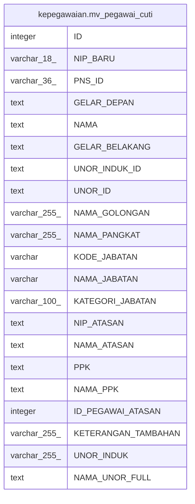

# kepegawaian.mv_pegawai_cuti

## Description

<details>
<summary><strong>Table Definition</strong></summary>

```sql
CREATE MATERIALIZED VIEW mv_pegawai_cuti AS (
 SELECT pegawai."ID",
    pegawai."NIP_BARU",
    pegawai."PNS_ID",
    btrim((pegawai."GELAR_DEPAN")::text) AS "GELAR_DEPAN",
    btrim((pegawai."NAMA")::text) AS "NAMA",
    btrim((pegawai."GELAR_BELAKANG")::text) AS "GELAR_BELAKANG",
    btrim((pegawai."UNOR_INDUK_ID")::text) AS "UNOR_INDUK_ID",
    btrim((pegawai."UNOR_ID")::text) AS "UNOR_ID",
    golongan."NAMA" AS "NAMA_GOLONGAN",
    golongan."NAMA_PANGKAT",
    jabatan."KODE_JABATAN",
    jabatan."NAMA_JABATAN",
    jabatan."KATEGORI_JABATAN",
    btrim((pt."NIP_ATASAN")::text) AS "NIP_ATASAN",
    btrim((pt."NAMA_ATASAN")::text) AS "NAMA_ATASAN",
    btrim((pt."PPK")::text) AS "PPK",
    btrim((pt."NAMA_PPK")::text) AS "NAMA_PPK",
    pt."ID" AS "ID_PEGAWAI_ATASAN",
    pt."KETERANGAN_TAMBAHAN",
    vw."UNOR_INDUK",
    vw."NAMA_UNOR_FULL"
   FROM (((((kepegawaian.pegawai pegawai
     LEFT JOIN kepegawaian.vw_unit_list vw ON (((pegawai."UNOR_ID")::text = (vw."ID")::text)))
     LEFT JOIN kepegawaian.golongan ON ((pegawai."GOL_ID" = golongan."ID")))
     LEFT JOIN kepegawaian.jabatan ON ((pegawai."JABATAN_INSTANSI_ID" = (jabatan."KODE_JABATAN")::bpchar)))
     LEFT JOIN kepegawaian.pegawai_atasan pt ON (((pegawai."NIP_BARU")::text = (pt."PNS_NIP")::text)))
     LEFT JOIN kepegawaian.pns_aktif pa ON ((pegawai."ID" = pa."ID")))
  WHERE ((pa."ID" IS NOT NULL) AND ((pegawai."KEDUDUKAN_HUKUM_ID")::text <> '99'::text) AND ((pegawai."KEDUDUKAN_HUKUM_ID")::text <> '66'::text) AND ((pegawai."KEDUDUKAN_HUKUM_ID")::text <> '52'::text) AND ((pegawai."KEDUDUKAN_HUKUM_ID")::text <> '20'::text) AND ((pegawai."KEDUDUKAN_HUKUM_ID")::text <> '04'::text) AND ((pegawai.status_pegawai <> 3) OR (pegawai.status_pegawai IS NULL)))
  ORDER BY vw."UNOR_INDUK"
)
```

</details>

## Columns

| Name | Type | Default | Nullable | Children | Parents | Comment |
| ---- | ---- | ------- | -------- | -------- | ------- | ------- |
| ID | integer |  | true |  |  |  |
| NIP_BARU | varchar(18) |  | true |  |  |  |
| PNS_ID | varchar(36) |  | true |  |  |  |
| GELAR_DEPAN | text |  | true |  |  |  |
| NAMA | text |  | true |  |  |  |
| GELAR_BELAKANG | text |  | true |  |  |  |
| UNOR_INDUK_ID | text |  | true |  |  |  |
| UNOR_ID | text |  | true |  |  |  |
| NAMA_GOLONGAN | varchar(255) |  | true |  |  |  |
| NAMA_PANGKAT | varchar(255) |  | true |  |  |  |
| KODE_JABATAN | varchar |  | true |  |  |  |
| NAMA_JABATAN | varchar |  | true |  |  |  |
| KATEGORI_JABATAN | varchar(100) |  | true |  |  |  |
| NIP_ATASAN | text |  | true |  |  |  |
| NAMA_ATASAN | text |  | true |  |  |  |
| PPK | text |  | true |  |  |  |
| NAMA_PPK | text |  | true |  |  |  |
| ID_PEGAWAI_ATASAN | integer |  | true |  |  |  |
| KETERANGAN_TAMBAHAN | varchar(255) |  | true |  |  |  |
| UNOR_INDUK | varchar(255) |  | true |  |  |  |
| NAMA_UNOR_FULL | text |  | true |  |  |  |

## Referenced Tables

| Name | Columns | Comment | Type |
| ---- | ------- | ------- | ---- |
| [kepegawaian.pegawai](kepegawaian.pegawai.md) | 100 |  | BASE TABLE |
| [kepegawaian.vw_unit_list](kepegawaian.vw_unit_list.md) | 30 |  | MATERIALIZED VIEW |
| [kepegawaian.golongan](kepegawaian.golongan.md) | 6 |  | BASE TABLE |
| [kepegawaian.jabatan](kepegawaian.jabatan.md) | 12 |  | BASE TABLE |
| [kepegawaian.pegawai_atasan](kepegawaian.pegawai_atasan.md) | 7 |  | BASE TABLE |
| [kepegawaian.pns_aktif](kepegawaian.pns_aktif.md) | 3 |  | VIEW |

## Relations



---

> Generated by [tbls](https://github.com/k1LoW/tbls)
