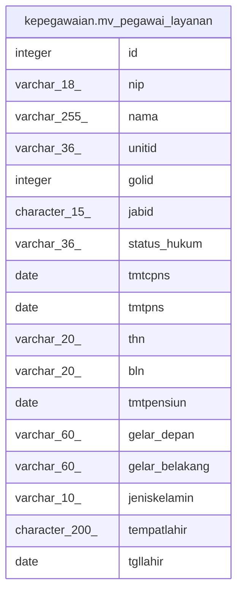

# kepegawaian.mv_pegawai_layanan

## Description

<details>
<summary><strong>Table Definition</strong></summary>

```sql
CREATE MATERIALIZED VIEW mv_pegawai_layanan AS (
 SELECT "ID" AS id,
    "NIP_BARU" AS nip,
    "NAMA" AS nama,
    "UNOR_ID" AS unitid,
    "GOL_ID" AS golid,
    "JABATAN_INSTANSI_ID" AS jabid,
    "KEDUDUKAN_HUKUM_ID" AS status_hukum,
    "TMT_CPNS" AS tmtcpns,
    "TMT_PNS" AS tmtpns,
    "MK_TAHUN" AS thn,
    "MK_BULAN" AS bln,
    "TMT_PENSIUN" AS tmtpensiun,
    "GELAR_DEPAN" AS gelar_depan,
    "GELAR_BELAKANG" AS gelar_belakang,
    "JENIS_KELAMIN" AS jeniskelamin,
    "TEMPAT_LAHIR" AS tempatlahir,
    "TGL_LAHIR" AS tgllahir
   FROM kepegawaian.pegawai pegawai
)
```

</details>

## Columns

| Name | Type | Default | Nullable | Children | Parents | Comment |
| ---- | ---- | ------- | -------- | -------- | ------- | ------- |
| id | integer |  | true |  |  |  |
| nip | varchar(18) |  | true |  |  |  |
| nama | varchar(255) |  | true |  |  |  |
| unitid | varchar(36) |  | true |  |  |  |
| golid | integer |  | true |  |  |  |
| jabid | character(15) |  | true |  |  |  |
| status_hukum | varchar(36) |  | true |  |  |  |
| tmtcpns | date |  | true |  |  |  |
| tmtpns | date |  | true |  |  |  |
| thn | varchar(20) |  | true |  |  |  |
| bln | varchar(20) |  | true |  |  |  |
| tmtpensiun | date |  | true |  |  |  |
| gelar_depan | varchar(60) |  | true |  |  |  |
| gelar_belakang | varchar(60) |  | true |  |  |  |
| jeniskelamin | varchar(10) |  | true |  |  |  |
| tempatlahir | character(200) |  | true |  |  |  |
| tgllahir | date |  | true |  |  |  |

## Referenced Tables

| Name | Columns | Comment | Type |
| ---- | ------- | ------- | ---- |
| [kepegawaian.pegawai](kepegawaian.pegawai.md) | 100 |  | BASE TABLE |

## Relations



---

> Generated by [tbls](https://github.com/k1LoW/tbls)
