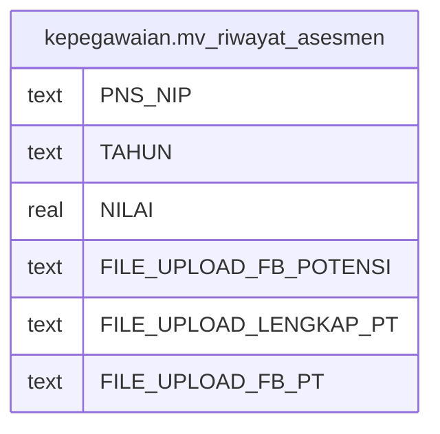

# kepegawaian.mv_riwayat_asesmen

## Description

<details>
<summary><strong>Table Definition</strong></summary>

```sql
CREATE MATERIALIZED VIEW mv_riwayat_asesmen AS (
 SELECT btrim((rwt_assesmen."PNS_NIP")::text) AS "PNS_NIP",
    btrim((rwt_assesmen."TAHUN")::text) AS "TAHUN",
    rwt_assesmen."NILAI",
    btrim((rwt_assesmen."FILE_UPLOAD")::text) AS "FILE_UPLOAD_FB_POTENSI",
    btrim((rwt_assesmen."FILE_UPLOAD")::text) AS "FILE_UPLOAD_LENGKAP_PT",
    btrim((rwt_assesmen."FILE_UPLOAD")::text) AS "FILE_UPLOAD_FB_PT"
   FROM kepegawaian.rwt_assesmen
  WHERE ((btrim((rwt_assesmen."TAHUN")::text) = ('2019'::bpchar)::text) AND (rwt_assesmen."FILE_UPLOAD" ~~* '%a_p%'::text) AND (rwt_assesmen."FILE_UPLOAD_EXISTS" = '1'::smallint))
UNION ALL
 SELECT btrim((rwt_assesmen."PNS_NIP")::text) AS "PNS_NIP",
    rwt_assesmen."TAHUN",
    rwt_assesmen."NILAI",
    btrim((rwt_assesmen."FILE_UPLOAD_FB_POTENSI")::text) AS "FILE_UPLOAD_FB_POTENSI",
    btrim((rwt_assesmen."FILE_UPLOAD_LENGKAP_PT")::text) AS "FILE_UPLOAD_LENGKAP_PT",
    btrim((rwt_assesmen."FILE_UPLOAD_FB_PT")::text) AS "FILE_UPLOAD_FB_PT"
   FROM kepegawaian.rwt_assesmen
  WHERE (btrim((rwt_assesmen."TAHUN")::text) <> ('2019'::bpchar)::text)
)
```

</details>

## Columns

| Name | Type | Default | Nullable | Children | Parents | Comment |
| ---- | ---- | ------- | -------- | -------- | ------- | ------- |
| PNS_NIP | text |  | true |  |  |  |
| TAHUN | text |  | true |  |  |  |
| NILAI | real |  | true |  |  |  |
| FILE_UPLOAD_FB_POTENSI | text |  | true |  |  |  |
| FILE_UPLOAD_LENGKAP_PT | text |  | true |  |  |  |
| FILE_UPLOAD_FB_PT | text |  | true |  |  |  |

## Referenced Tables

| Name | Columns | Comment | Type |
| ---- | ------- | ------- | ---- |
| [kepegawaian.rwt_assesmen](kepegawaian.rwt_assesmen.md) | 19 |  | BASE TABLE |

## Relations



---

> Generated by [tbls](https://github.com/k1LoW/tbls)
