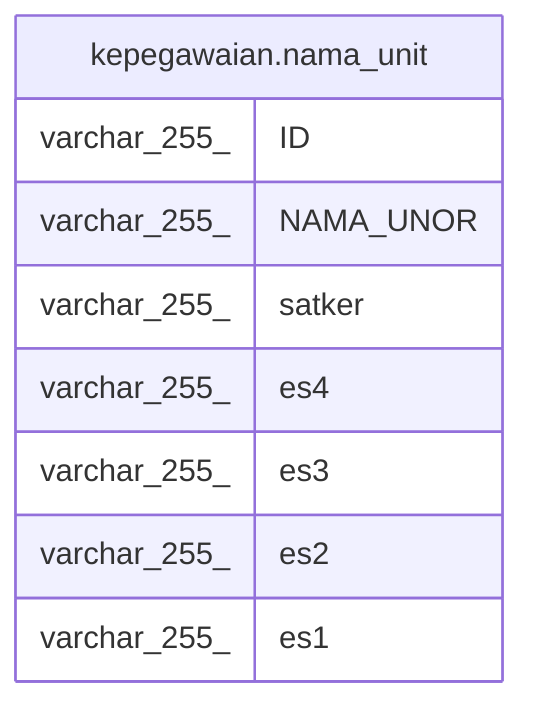

# kepegawaian.nama_unit

## Description

<details>
<summary><strong>Table Definition</strong></summary>

```sql
CREATE VIEW nama_unit AS (
 SELECT "ID",
    "NAMA_UNOR",
    ( SELECT unitkerja."NAMA_UNOR"
           FROM kepegawaian.unitkerja unitkerja
          WHERE ((unitkerja."ID")::text = (a."UNOR_INDUK")::text)) AS satker,
    ( SELECT unitkerja."NAMA_UNOR"
           FROM kepegawaian.unitkerja unitkerja
          WHERE ((unitkerja."ID")::text = (a."ESELON_4")::text)) AS es4,
    ( SELECT unitkerja."NAMA_UNOR"
           FROM kepegawaian.unitkerja unitkerja
          WHERE ((unitkerja."ID")::text = (a."ESELON_3")::text)) AS es3,
    ( SELECT unitkerja."NAMA_UNOR"
           FROM kepegawaian.unitkerja unitkerja
          WHERE ((unitkerja."ID")::text = (a."ESELON_2")::text)) AS es2,
    ( SELECT unitkerja."NAMA_UNOR"
           FROM kepegawaian.unitkerja unitkerja
          WHERE ((unitkerja."ID")::text = (a."ESELON_1")::text)) AS es1
   FROM kepegawaian.unitkerja a
)
```

</details>

## Columns

| Name | Type | Default | Nullable | Children | Parents | Comment |
| ---- | ---- | ------- | -------- | -------- | ------- | ------- |
| ID | varchar(255) |  | true |  |  |  |
| NAMA_UNOR | varchar(255) |  | true |  |  |  |
| satker | varchar(255) |  | true |  |  |  |
| es4 | varchar(255) |  | true |  |  |  |
| es3 | varchar(255) |  | true |  |  |  |
| es2 | varchar(255) |  | true |  |  |  |
| es1 | varchar(255) |  | true |  |  |  |

## Referenced Tables

| Name | Columns | Comment | Type |
| ---- | ------- | ------- | ---- |
| [kepegawaian.unitkerja](kepegawaian.unitkerja.md) | 30 |  | BASE TABLE |

## Relations



---

> Generated by [tbls](https://github.com/k1LoW/tbls)
