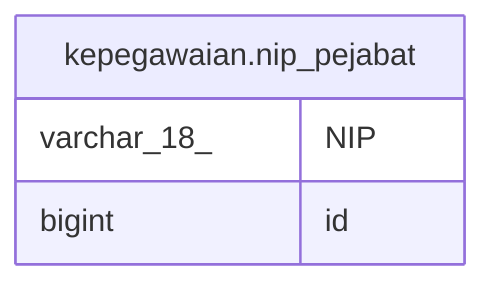

# kepegawaian.nip_pejabat

## Description

## Columns

| Name | Type | Default | Nullable | Children | Parents | Comment |
| ---- | ---- | ------- | -------- | -------- | ------- | ------- |
| NIP | varchar(18) |  | false |  |  |  |
| id | bigint | nextval('kepegawaian.nip_pejabat_id_seq'::regclass) | false |  |  |  |

## Relations

---

> Generated by [tbls](https://github.com/k1LoW/tbls)
